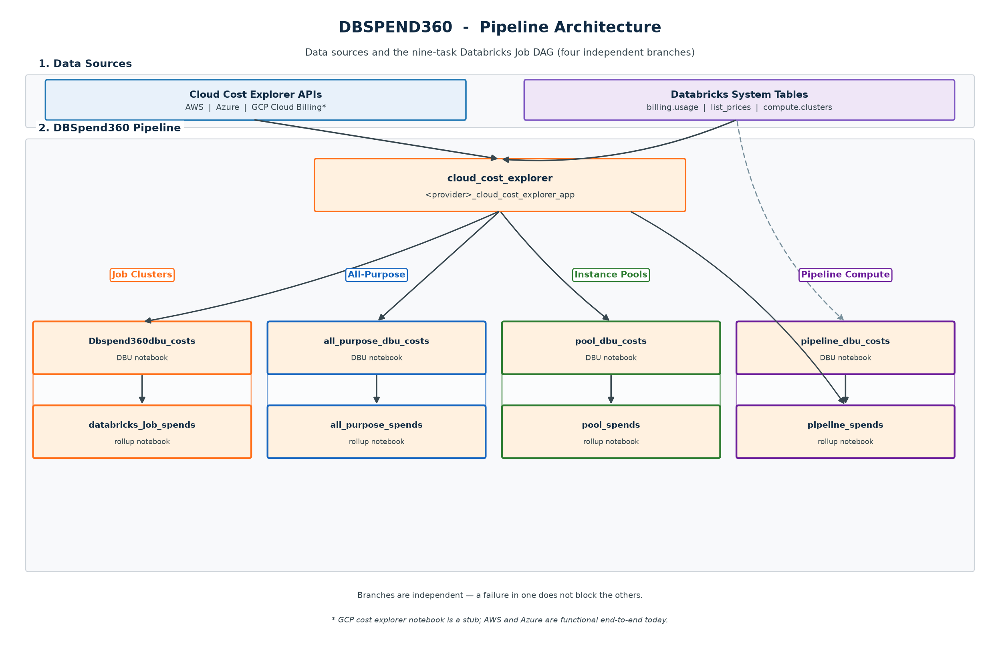
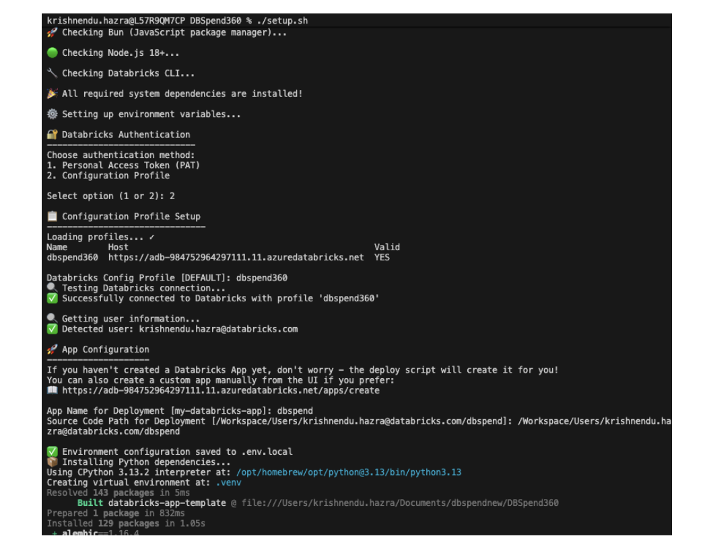
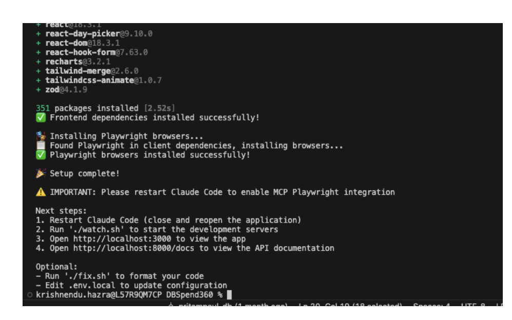
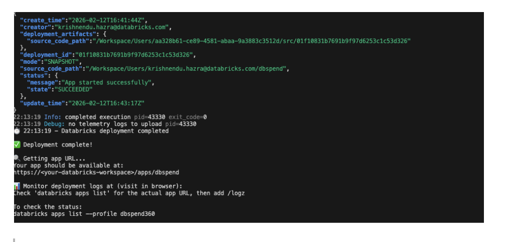
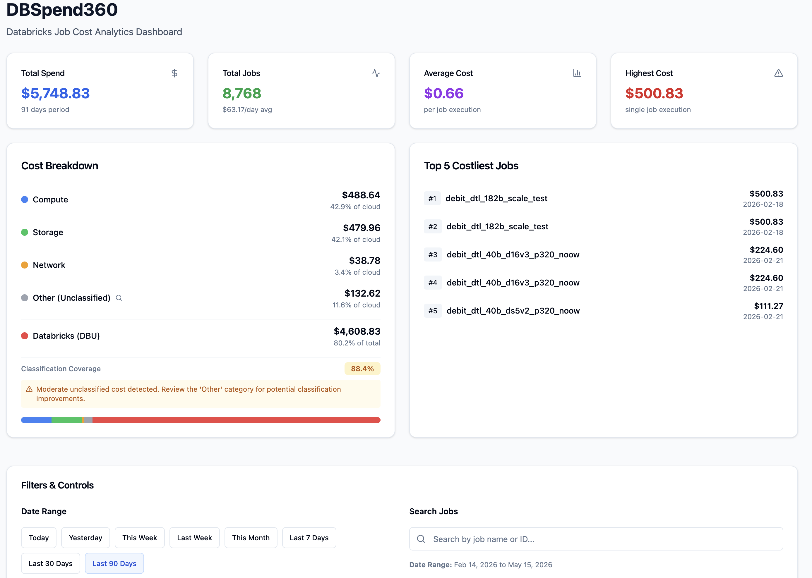
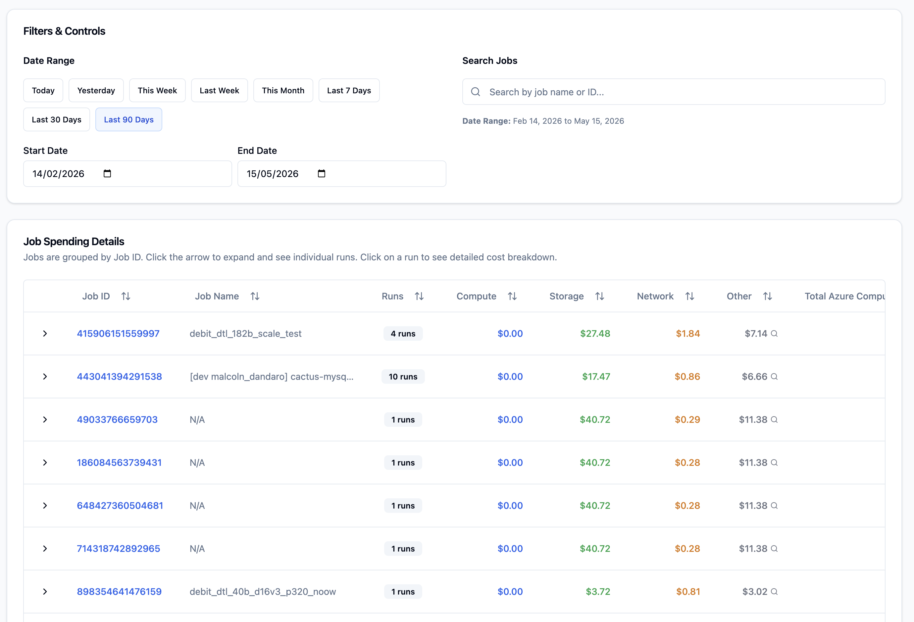
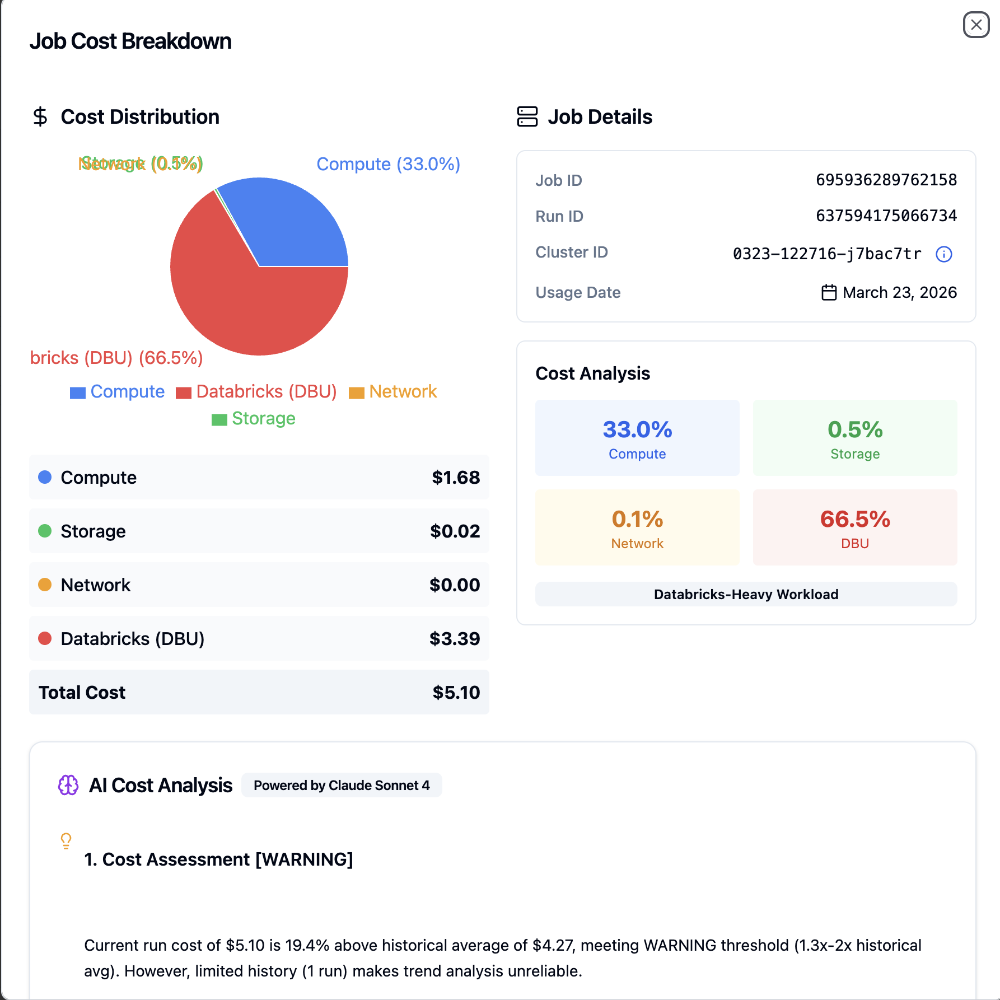

# DBSPEND360

## 1. Overview

* DBSPEND360 is a Databricks-native solution that provides cost visibility across jobs, all-purpose clusters, instance pools, pipelines, and SQL warehouses.

* Tracks end-to-end cost at job, run, and cluster level for Databricks jobs; all-purpose cluster spend by owner; instance pool capacity and attribution; and pipeline / serverless compute.
* Combines cloud VM cost (AWS Cost Explorer or Azure Cost Management) with Databricks DBU cost from system billing tables.
* Produces five rollup tables — one per app tab — with `dbspend360_total_job_spends` as the Job Clusters source of truth.
* Includes audit and error logging to support incremental loads, monitoring, and reconciliation.
* Powers the DBSPEND360 Databricks App (five cost tabs + AI insights), which provides dashboards and AI-driven cost and performance recommendations.

> **SQL Warehouse cost scope:** Serverless SQL Warehouse DBU includes infrastructure. Classic and Pro values are DBU-only until customer-cloud VM, disk, and network charges can be attributed to a warehouse; the app labels those values accordingly.

> **Status:** AWS and Azure are functional end-to-end today. GCP is wired through the config, UI label, and LLM layers, but the GCP cloud cost explorer ETL (`jobs/notebooks/gcp_cloud_cost_explorer_app.ipynb`) is a stub that raises `NotImplementedError` and needs to be implemented before GCP can be selected as the active provider.


<br>
<br>


## 2. Architecture

DBSPEND360 splits into a multi-branch **Databricks Job pipeline** and a **Databricks App** (five cost tabs + AI insights). The pipeline writes curated Unity Catalog tables; the app reads rollup tables at query time and optionally enriches rows from system tables.

| Diagram | Best for |
|---|---|
| **Pipeline Architecture** | The 12-task job DAG, branch isolation, and task dependencies |
| **Data & Consumption** | Which Delta tables each tab reads, drill-down, enrichment, and AI |
| **Implementation Flow** | Full stack — config → ingest → branches → rollups → app |

### Pipeline Architecture

12-task Databricks Job DAG. `create_all_tables` creates tables once at setup; the job only loads data. `cloud_cost_explorer` fans out into four DBU → rollup branches (Job Clusters, All-Purpose, Instance Pools, Pipeline Compute). Each of those DBU tasks also waits on `covered_workspaces`. SQL Warehouses is a fifth DBU → rollup branch that waits on coverage only (no cloud ingest). Cloud VM cost is joined in the rollup notebooks, not in DBU ingest. Downstream branch failures remain isolated; shared cloud ingestion is a correctness gate for the four cloud-backed branches.



### Data & Consumption

Curated Delta tables produced by the pipeline and how the five-tab app consumes them. Shared explorer tables (`dbspend360_cloud_cost_explorer`, `dbspend360_pool_cloud_cost_explorer`, `dbspend360_other_cost_breakdown`) feed branch-specific rollups; each app tab reads its rollup table. `dbspend360_other_cost_breakdown` powers per-service drill-down. At query time the app optionally enriches rows from `system.lakeflow.jobs`, `system.compute.clusters`, `system.compute.instance_pools`, `system.lakeflow.pipelines`, and `system.compute.warehouses`. AI recommendations are served via `databricks-claude-sonnet-4` Model Serving.


### Implementation Flow

End-to-end view from cloud provider config through shared ingest, five parallel branches, rollup tables, and the app.


## 3. Usage

* Clone the DBSPEND360 Databricks app repo:

    ```bash
    git clone https://github.com/AdityaMandiwal/DBSPEND360.git
    cd DBSPEND360
    ```

* `jobs/` contains all the DDL notebooks, ETL notebooks, and the Databricks Job resource template for DBSPEND360.
* `release/` contains `DBSpend360-Product-Release.docx` and the per-cloud credentials setup guides needed for data ingestion from each cost explorer:
    * `release/AWS Credentials and Permissions Setup.md` — the single required Cost Explorer API (`ce:GetCostAndUsage`, us-east-1), minimal IAM policy (inline JSON), the Unity Catalog service credential (`dbspend-read-ce`) auth wiring, the `ClusterId` / `DatabricksInstancePoolId` tagging convention used to join line items back to Databricks, and a verification `aws ce get-cost-and-usage` command.
    * `release/Azure Credentials and Permissions Setup.md` — Azure Cost Management API/SDK, Entra ID app-registration (service principal) walkthrough, the `Cost Management Reader` role assignment at subscription scope, how the SPN credentials are delivered via a Databricks secret scope, the `clusterid` tag convention, and a verification `az rest` query.
    * `release/GCP Credentials and Permissions Setup.md` — stub placeholder; pending the GCP cost explorer implementation. Outlines the GCP APIs (Cloud Billing / BigQuery), IAM roles, and verification steps that will be needed once the notebook is implemented.

### Prerequisites

Install the following on your local machine before running `setup.sh` (the script will verify each one):

* Git
* [uv](https://docs.astral.sh/uv/) — Python package manager
* [Bun](https://bun.sh/) — JavaScript package manager
* Node.js 18 or newer
* [Databricks CLI](https://docs.databricks.com/dev-tools/cli/index.html) (v0.265.0+ for `databricks apps` support)
* On macOS only: Homebrew (used by `setup.sh` to install missing dependencies)

### Configure Databricks authentication

Configure local Databricks authentication using **either**:

* **A named profile in `~/.databrickscfg`** (recommended for repeated use). Use any name you like — `DEFAULT` works, but a workspace-specific name is clearer once you have more than one workspace. `setup.sh` lists the profiles found in this file via `databricks auth profiles` and asks which one to use:

    ```ini
    [my-workspace]
    host  = https://<your-workspace>.cloud.databricks.com
    token = <your-personal-access-token>
    ```

* **Environment variables** (set in your shell or `.env.local`). Use these when you don't want a profile file on disk — `setup.sh` will pick them up if you select PAT authentication:

    ```bash
    export DATABRICKS_HOST=https://<your-workspace>.cloud.databricks.com
    export DATABRICKS_TOKEN=<your-personal-access-token>
    ```

### Deploy the data pipeline (Databricks Job)

The Databricks App reads **five rollup tables** (one per cost tab), all produced by the same multi-task Databricks Job — see [§2 Data & Consumption](#data--consumption). **Deploy and run this pipeline before deploying the app**, otherwise the dashboards render empty and the AI insights have no data to analyze.

1. Import everything under `jobs/notebooks/` and `jobs/ddls/` into your Databricks workspace.
2. Run `jobs/ddls/create_all_tables.ipynb` once against the catalog/schema you intend to use. The orchestrator includes the coverage table plus staging and rollup DDLs for all five tabs, including `dbspend360_sql_warehouse_dbu_cost` and `dbspend360_total_sql_warehouse_spends`.
3. Use `jobs/resource_templates/DBSPEND360.yaml` as the basis for the Databricks Job. Tables are created once by `create_all_tables`; the job only loads data. It has 12 tasks: coverage, cloud ingest, and five DBU/rollup branches. Four branches fan out from the shared cloud-cost ingest; SQL Warehouses is DBU-only:

   ```
   covered_workspaces ─┐
   cloud_cost_explorer ┤
                       ├─ Dbspend360dbu_costs ──────────────── databricks_job_spends
                       ├─ Dbspend360_all_purpose_dbu_costs ─── all_purpose_spends
                       ├─ Dbspend360_pool_dbu_costs ────────── pool_spends
                       └─ Dbspend360_pipeline_dbu_costs ────── pipeline_spends

   covered_workspaces ── Dbspend360_sql_warehouse_dbu_costs ── sql_warehouse_spends
   ```

   * `cloud_cost_explorer` → `${cloud_provider}_cloud_cost_explorer_app` — cloud-source-agnostic; feeds every branch. On **both AWS and Azure** it writes **two** explorer tables: `dbspend360_cloud_cost_explorer` (grouped by `ClusterId`/`clusterid`, feeds Job/All-Purpose/Pipeline) and `dbspend360_pool_cloud_cost_explorer` (grouped by `DatabricksInstancePoolId`, feeds Instance Pools). Both outputs are required: a pool-path failure fails the task so downstream rollups cannot refresh from stale pool cloud data while the job reports success.
   * Job Clusters branch (writes `dbspend360_total_job_spends`):
     * `Dbspend360dbu_costs` → `dbspend360_dbu_cost_app`
     * `databricks_job_spends` → `databricks_job_spends_app`
   * All-Purpose Clusters branch (writes `dbspend360_total_all_purpose_spends`):
     * `Dbspend360_all_purpose_dbu_costs` → `dbspend360_all_purpose_dbu_cost_app`
     * `all_purpose_spends` → `all_purpose_spends_app`
   * Instance Pools branch (writes `dbspend360_total_pool_spends`):
     * `Dbspend360_pool_dbu_costs` → `dbspend360_pool_dbu_cost_app`
     * `pool_spends` → `pool_spends_app`
   * Pipeline Compute branch (writes `dbspend360_total_pipeline_spends`):
     * `Dbspend360_pipeline_dbu_costs` → `dbspend360_pipeline_dbu_cost_app`
     * `pipeline_spends` → `pipeline_spends_app` (same shape as Job / All-Purpose: waits on its DBU task, which already waited on cloud ingest)
   * SQL Warehouses branch (writes `dbspend360_total_sql_warehouse_spends`):
     * `Dbspend360_sql_warehouse_dbu_costs` → `dbspend360_sql_warehouse_dbu_cost_app`
     * `sql_warehouse_spends` → `sql_warehouse_spends_app` (DBU-only ETL; no cloud explorer dependency)

   The DBU/rollup branches are independent after their declared prerequisites;
   the shared cloud ingest is a correctness gate for its dependent branches.
   Each branch applies its own attribution logic (cluster-source filter,
   owner-based attribution, cloud-cost joins, and the cross-tab overlap model
   documented in section 4 below).

   **Update the hard-coded `notebook_path` values** in the YAML to match where you imported the notebooks (the template currently points at a developer workspace path), and review the default `parameters` block (`catalog`, `cloud_provider`, `overlap_days`, `schema`, `workspace_ids`, `subscription_id`, `scope`) before deploying. The last two (`subscription_id` and `scope`) are Azure-only — the subscription id and the secret-scope name holding `tenant_id`/`client_id`/`client_secret`; they are inert empty defaults on AWS/GCP.
4. Create the job either via the Databricks Workflows UI using the YAML as a reference, or by wrapping it in a Databricks Asset Bundle.
5. Run the job at least once and confirm all five rollup tables have rows (`dbspend360_total_job_spends`, `dbspend360_total_all_purpose_spends`, `dbspend360_total_pool_spends`, `dbspend360_total_pipeline_spends`, `dbspend360_total_sql_warehouse_spends`) before moving on to the app deployment steps below.


### Step by step setup

* In the `config/` folder change the values in `app.dev.config` for:
    1. `platform` (under `[cloud]`) — set to the cloud where your Databricks workloads run: `AWS`, `Azure`, or `GCP`. The shipped value may not match your environment, so verify it explicitly. See [Cloud Provider Selection](#cloud-provider-selection) below for what this drives.
    2. `warehouse_id` — the SQL warehouse the app should query.
    3. `table_name` — fully qualified `catalog.schema.table` for `dbspend360_total_job_spends`.
    4. `schema_name` — fully qualified `catalog.schema` used by the app.

> **Note:** `config/app.dev.config` also ships `all_purpose_table_name`, `pool_table_name`, `pipeline_table_name`, and `sql_warehouse_table_name`. The app reads **five** rollup tables. If you omit these keys, `server/config/config_loader.py` derives them from `schema_name`; set them explicitly if your tables do not follow the standard names.


* Run `./setup.sh` and follow the prompts in this order:


  1. **Choose an authentication method:**
     * `1` — Personal Access Token (PAT). `setup.sh` then prompts for `DATABRICKS_HOST` and the PAT itself (hidden input), and writes both to `.env.local`.
     * `2` — Configuration Profile. `setup.sh` runs `databricks auth profiles` to list the profiles in your `~/.databrickscfg`, prompts you to pick one (defaults to `DEFAULT`), and tests the connection. If the profile is missing or invalid you can let it run `databricks auth login --profile <name>` for you.
  2. **App name for deployment** — must be lowercase; digits and hyphens are allowed, but uppercase letters and other special characters are not.
  3. **Source code path** — workspace path under which the app's source code will be stored on deploy (defaults to a path derived from your app name).







* Run the deploy command: `./deploy.sh --verbose --create` (this creates and deploys the app)





### Required Grants for the App Service Principal

When the app is deployed as a Databricks App, it runs under a **service principal** that may not have explicit permissions on your warehouse, Unity Catalog objects, or model serving endpoints — even if it belongs to an admins group. Without these grants, the app will return empty results or fail to render AI insights.

Find your app's service principal ID from the Databricks App settings page, then apply the grants below.

#### SQL warehouse

Grant via the SQL Warehouse permissions UI (or via REST API):

* `CAN USE` on the SQL warehouse referenced by `warehouse_id` in `config/app.dev.config` (or whichever env-specific config file you maintain — only `app.dev.config` ships in the repo today).

#### Unity Catalog (catalog / schema / table)

Run the following SQL in a Databricks SQL editor or notebook:

```sql
-- Replace <YOUR_CATALOG>, <YOUR_SCHEMA>, and <APP_SERVICE_PRINCIPAL_ID> with your values.

-- Allow the service principal to see the catalog
GRANT USE CATALOG ON CATALOG <YOUR_CATALOG> TO `<APP_SERVICE_PRINCIPAL_ID>`;

-- Allow the service principal to see the schema
GRANT USE SCHEMA ON SCHEMA <YOUR_CATALOG>.<YOUR_SCHEMA> TO `<APP_SERVICE_PRINCIPAL_ID>`;

-- Allow the service principal to read all tables in the schema.
-- `SELECT ON SCHEMA` inherits to every existing table AND any tables
-- created later in this schema, so you don't need per-table grants.
GRANT SELECT ON SCHEMA <YOUR_CATALOG>.<YOUR_SCHEMA> TO `<APP_SERVICE_PRINCIPAL_ID>`;
```

#### Model serving endpoint (for AI insights)

The app uses `databricks-claude-sonnet-4` as the foundation model to generate cost and performance recommendations. Grant:

* `CAN QUERY` on the `databricks-claude-sonnet-4` model serving endpoint.

If this grant is missing, the dashboard still loads but the AI Cost Analysis panel will not render. AI analysis is gated by `enable_cost_analysis` / `enable_cluster_analysis` under `[features]` in your config file.

#### Optional: System Table Access

The app also queries system tables at request time to enrich cost data with names and drill-down detail. Granting SELECT on these tables requires **account admin** privileges. Without these grants the tabs still load, but names and detail panels may be incomplete.

| System table | Used by |
|---|---|
| `system.lakeflow.jobs` | Job Clusters tab — job names |
| `system.compute.clusters` | Job Clusters and All-Purpose tabs — cluster names and config |
| `system.compute.instance_pools` | Instance Pools tab — pool names and config |
| `system.lakeflow.pipelines` | Pipeline Compute tab — pipeline names and config |
| `system.lakeflow.job_run_timeline` | Job run analysis — filter to succeeded runs for baselines |

If an account admin is available, ask them to run:

```sql
GRANT SELECT ON TABLE system.lakeflow.jobs TO `<APP_SERVICE_PRINCIPAL_ID>`;
GRANT SELECT ON TABLE system.compute.clusters TO `<APP_SERVICE_PRINCIPAL_ID>`;
GRANT SELECT ON TABLE system.compute.instance_pools TO `<APP_SERVICE_PRINCIPAL_ID>`;
GRANT SELECT ON TABLE system.lakeflow.pipelines TO `<APP_SERVICE_PRINCIPAL_ID>`;
GRANT SELECT ON TABLE system.lakeflow.job_run_timeline TO `<APP_SERVICE_PRINCIPAL_ID>`;
```









### Cloud Provider Selection

DBSPEND360 is cloud-agnostic at the data layer (`dbspend360_cloud_cost_explorer.cloud_cost`) and label-aware at the UI / LLM layer. Pick a provider in `config/app.dev.config` (or whichever env-specific config file you maintain). The shipped value in the repo is set to one cloud for local development — always set this explicitly for your environment:

```ini
[cloud]
# Supported platforms: AWS, Azure, GCP
platform = AWS   # example only — replace with AWS, Azure, or GCP
```

> **Note:** GCP is selectable in config and wired through the cluster-attribute, label-rendering, and LLM layers, but the `gcp_cloud_cost_explorer_app` notebook is a stub and currently raises `NotImplementedError`. Only AWS and Azure are functional end-to-end today.

The chosen `platform` value drives, end-to-end:

1. **Notebook selection** — the `cloud_provider` job parameter in
   `jobs/resource_templates/DBSPEND360.yaml` resolves to
   `${cloud_provider}_cloud_cost_explorer_app`, i.e.
   `aws_cloud_cost_explorer_app`, `azure_cloud_cost_explorer_app`, or
   `gcp_cloud_cost_explorer_app`.
2. **Cluster-attribute reads** — `get_cluster_details` reads whichever of
   `aws_attributes` / `azure_attributes` / `gcp_attributes` is populated on
   `system.compute.clusters` (see `server/services/databricks_service.py`).
3. **Label rendering** — the `/api/cloud-platform` endpoint feeds
   `CloudPlatformContext` so frontend tables/cards render
   "EC2 Cost", "Azure Compute Cost", or "GCE Cost" dynamically.
4. **LLM prompts** — cluster-analysis prompts in `server/services/llm_service.py`
   substitute the active provider's name so insights stay grounded.


## 4. Cost attribution across tabs (and why they don't sum to the AWS bill)

The app exposes five cost tabs — **Job Clusters**, **All-Purpose Clusters**,
**Instance Pools**, **Pipeline Compute**, and **SQL Warehouses**. Each one looks at the *same*
underlying compute through a different lens, so **the tabs intentionally overlap
and are not meant to add up to your AWS invoice.** Treat each tab as a focused
view, not a slice of a pie. This is the same already-accepted behavior the DBU
numbers have always had.

### 4.1 DBU overlap is by design

A single run can be counted in more than one tab depending on how you ask about
it. For example, a job whose cluster borrows VMs from an instance pool shows DBU
in both the **Job Clusters** tab (attributed to the job) and the **Instance
Pools** tab (attributed to the pool). That is not double-billing — it is the same
spend described from two angles. Per-tab DBU is correct *within* its lens; summing
DBU *across* tabs is not meaningful.

### 4.2 EC2 / EBS cloud cost overlap

Cloud (EC2/EBS) cost is attributed by AWS resource tag, and the two explorer
tables are kept **disjoint** so the cloud numbers do not double-count across tabs:

* `dbspend360_cloud_cost_explorer` groups EC2/EBS by the **`ClusterId`** tag and
  feeds the Job Clusters, All-Purpose Clusters, and Pipeline Compute tabs.
* `dbspend360_pool_cloud_cost_explorer` groups EC2/EBS by the
  **`DatabricksInstancePoolId`** tag and feeds the Instance Pools tab. It nets
  out every row that also carries `ClusterId`, so the pool tab's cloud line is
  specifically **ClusterId-free idle/warm capacity**. Active pool-backed VM
  cost remains on the Job or All-Purpose cluster lens. This makes the cloud
  slices disjoint; it does not make the pool tab a complete active + idle VM
  total.

Even so, **no tab — and no sum of tabs — equals the AWS EC2 bill.** Only
tag-attributable compute is captured; account-wide shared infrastructure (NAT
gateways, S3, ELB, VPC, data transfer, and any untagged compute) is deliberately
**not** allocated onto jobs, clusters, pools, or pipelines. Proportional
allocation of that shared infra is intentionally out of scope here.

A few honest-by-design gaps you will see rendered as `—` (a dash) plus a tooltip,
never as a misleading `$0`:

* **Serverless pipelines** — EC2 cost is bundled into the serverless DBU rate;
  there is no separate VM line to show.
* **Per-cluster rows inside a pool drill-down** — pool VM cost is tracked at the
  pool level (AWS tags pool instances with `DatabricksInstancePoolId`, not
  `ClusterId`), not per attached cluster.
* **A classic cluster / pool-day with no matching explorer row yet** — Cost
  Explorer lag or an untagged resource; the value is *unknown*, not zero.

### 4.3 Reconciliation and monitoring

Every cloud-cost join is reconciled back to its explorer source and is
self-monitoring:

* **Reconciliation invariant** — for each `(cluster_id, day, currency)`
  (pipeline) and each `(instance_pool_id, day, currency)` (pools), the cloud cost
  written to the rollup must equal the explorer source within **$0.01**. The
  rollup notebooks assert this on the intermediate join (before the grain
  collapse) and write any mismatch to `dbspend360_error_log` instead of failing
  silently.
* **Post-write monitors** — if a window's pool (or cluster) `cloud_cost`
  collapses to ~0 while DBU is non-zero — the classic signature of a dropped
  billing tag — the explorer and rollup notebooks raise a non-silent alarm rather
  than quietly writing zeros.
* **Audit + error logs** — `dbspend360_audit_log` records per-run row counts and
  windows; `dbspend360_error_log` captures reconciliation mismatches and
  failures. Pool-tag ingestion records its failure and re-raises so stale pool
  cloud data cannot be consumed under a successful job state.

### 4.4 Azure: the same model, sourced from Cost Management

On **Azure** the picture is identical in shape — both explorer tables are written
by `azure_cloud_cost_explorer_app`, which queries Azure **Cost Management**
instead of AWS Cost Explorer:

* `dbspend360_cloud_cost_explorer` groups by the **`clusterid`** tag (plus
  `MeterCategory`) and feeds the Job Clusters, All-Purpose Clusters, and Pipeline
  Compute tabs — this has always worked on Azure.
* `dbspend360_pool_cloud_cost_explorer` groups by the
  **`DatabricksInstancePoolId`** tag and feeds the Instance Pools tab. This is the
  isolated `run_pool()` path in the cloud cost explorer notebooks. It
  groups by **both** the pool and `clusterid` tags and applies the same **netting
  guard** (keep only the `clusterid`-free slice), so Azure pool cloud cost is
  the idle/warm slice and is disjoint from active cluster cloud cost, exactly
  as on AWS.

Two Azure specifics worth knowing:

* **Pool cost is a single `cloud_cost` bucket; the per-service
  compute/storage/network/other segments are `NULL` by design** — not missing
  data. Azure Cost Management caps a query at **two** grouping dimensions, and
  both slots are spent on the pool + cluster tags for the netting guard, leaving
  no slot for `MeterCategory`. We deliberately prioritize disjointness over
  segmentation (matching the AWS pool path).
* **The pool path is a required correctness gate.** A
  `DatabricksInstancePoolId` tagging lapse or Cost Management schema drift logs
  `POOL_COST_EXPLORER_FAILED`, writes a FAILED pool audit row, and re-raises so
  downstream rollups cannot consume stale pool cloud data under a successful
  job state. The same `~0 cloud while DBU>0` post-write monitor fires a
  non-silent `POOL_COST_MONITOR_ALARM`.

Everything downstream of the explorer — the pool rollup, the service layer, the
API, and the frontend labels — is cloud-agnostic and unchanged; only the explorer
notebook learns to source Azure pool cost.


## 5. Tab data lineage (system tables & key filters)

Each app tab reads one precomputed rollup table (see `table_name`,
`all_purpose_table_name`, `pool_table_name`, `pipeline_table_name`, and
`sql_warehouse_table_name` in
`config/app.dev.config`). The Databricks Job builds those rollups from Databricks
**system tables** plus cloud cost explorer output. The five tabs scope the same
underlying compute differently — they overlap by design (see section 4).

| Tab | Rollup table | System tables (ETL) | Key scope / join keys |
|---|---|---|---|
| **Job Clusters** | `dbspend360_total_job_spends` | `system.billing.usage`, `system.billing.list_prices`, `system.compute.clusters` | `cluster_source = 'JOB'`; `job_run_id IS NOT NULL`; grain includes `cluster_id`, `job_id`, `run_id`. Cloud VM from `dbspend360_cloud_cost_explorer` joined on `cluster_id` (AWS/Azure tag `ClusterId` / `clusterid`). |
| **All-Purpose Clusters** | `dbspend360_total_all_purpose_spends` | `system.billing.usage`, `system.billing.list_prices`, `system.compute.clusters` | `cluster_source IN ('UI','API')`; `job_run_id IS NULL`; grain is `(cluster_id, user_id, usage_date)` with `owned_by` from clusters. Same cluster cloud explorer as Job Clusters. |
| **Instance Pools** | `dbspend360_total_pool_spends` | `system.billing.usage`, `system.billing.list_prices`, `system.compute.instance_pools` | `usage_metadata.instance_pool_id IS NOT NULL` (any `cluster_source`). Grain is `(instance_pool_id, cluster_id, usage_date)`; idle pool capacity uses `cluster_id = '__pool_overhead__'`. Cloud VM from `dbspend360_pool_cloud_cost_explorer` joined on `DatabricksInstancePoolId` tag — not `cluster_id`. |
| **Pipeline Compute** | `dbspend360_total_pipeline_spends` | `system.billing.usage`, `system.billing.list_prices`, `system.lakeflow.pipelines` | `usage_metadata.dlt_pipeline_id IS NOT NULL` (DLT, DBSQL MVs, online tables, vector search, model serving, AI functions). Grain is `(workspace_id, pipeline_id, usage_date, billing_origin_product)`; `cluster_id IS NULL` marks serverless. Classic pipeline VM cost joins `dbspend360_cloud_cost_explorer` on `cluster_id`. |

**App-time enrichment (optional grants):** beyond the rollup tables, the app
queries system tables at request time for names and drill-down detail —
`system.lakeflow.jobs` and `system.compute.clusters` (Job Clusters),
`system.compute.clusters` (All-Purpose), `system.compute.instance_pools` (Instance
Pools), and `system.lakeflow.pipelines` (Pipeline Compute). Job run analysis may
also read `system.lakeflow.job_run_timeline`. Without these grants the tabs still
load, but names and detail panels may be incomplete. See [Required Grants for the
App Service Principal](#required-grants-for-the-app-service-principal).
