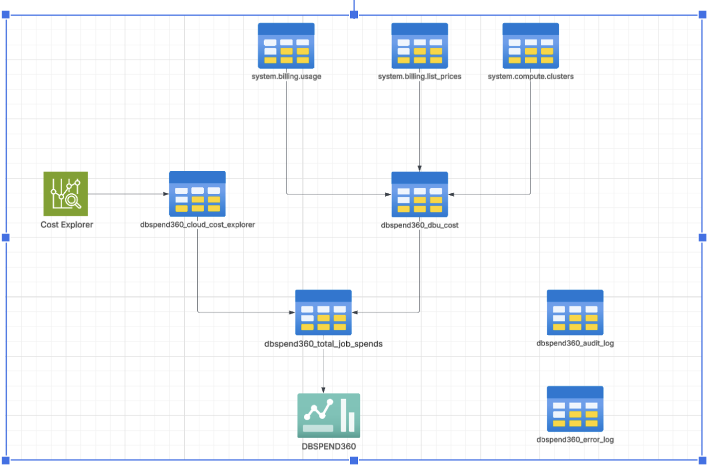

# DBSPEND360

## 1. Overview

* DBSPEND360 is a Databricks-native solution that provides clear job-level visibility into cloud and DBU spends for Databricks workloads.

* Tracks end-to-end cost at job, run, and cluster level for Databricks jobs.
* Combines cloud VM cost (AWS Cost Explorer, Azure Cost Management, or — once implemented — GCP Cloud Billing) with Databricks DBU cost from system billing tables.
* Produces a consolidated dbspend360_total_job_spends table as the single source of truth for job-level cost.
* Includes audit and error logging to support incremental loads, monitoring, and reconciliation.
* Powers the DBSPEND360 Databricks App, which provides dashboards and AI-driven cost and performance recommendations.


<br>
<br>


## 2. Architecture

### Logical Architecture Diagram




### Implementation Flow


## 3. Usage


* Download the DBSPEND360 databricks app repo from https://github.com/pritampaul-db/DBSpend360.

* Jobs folder contains all the DDL, Notebooks , and resource template for DBSPEND360 Job.
* release folder contains the product release doc and the per-cloud credentials setup guides needed for data ingestion from each cost explorer:
    * `release/AWS Credentials and Permissions Setup.md` — AWS Cost Explorer / CUR setup.
    * `release/Azure Credentials and Permissions Setup.docx` — Azure Cost Management SPN setup.
    * `release/GCP Credentials and Permissions Setup.md` — GCP Cloud Billing setup (stub; pending implementation).
* README.md contains all the usage related description as mentioned below:

    1. Setup your local databrickscfg file with DATABRICKS_HOST and DATABRICKS_TOKEN details.
    2. Update config file from config-> app.dev.config , this will be used to deploy the app.

### Step by step setup

* Change directory to DBSpend360 in your cloned git folder using:

    ```bash
    cd DBSpend360
    ```

* In the config folder change the values in  app.dev.config for:
    1. Warehouse_id
    2. Table_name (catalog.schema.table)
    3. Schema_name (catalog.schema)


* Run setup.sh and follow the below steps:


  1. Choose the Authentication type
  2. Choose the databricks configuration profile you want to use to deploy the app
  3. Give an app name: App name should not have cap letters or numbers
  4. Give the source code path to store all the app related code/assets


* Run the deploy command : ./deploy.sh --verbose --create (This creates and deploys the app)


* App SPN should have below permissions:

  1. CAN USE for the sql warehouse mentioned in the app config file.
  2. USE CATALOG, USE SCHEMA, SELECT permissions on the catalog, schema, table name used for sourcing the data of the databricks app from dbspend360_total_job_spends.
  3. App uses databricks-claude-sonnet-4 as foundation model to generate insights for cost/performance improvements.


### Unity Catalog Grants for the App Service Principal

When the app is deployed as a Databricks App, it runs under a **service principal** that may not have explicit Unity Catalog permissions on your tables, even if it belongs to an admins group. Without these grants, the app will return empty results despite the underlying tables having data.

Find your app's service principal ID from the Databricks App settings page, then run the following SQL grants in a Databricks SQL editor or notebook:

```sql
-- Replace <YOUR_CATALOG>, <YOUR_SCHEMA>, and <APP_SERVICE_PRINCIPAL_ID> with your values.

-- Allow the service principal to see the catalog
GRANT USE CATALOG ON CATALOG <YOUR_CATALOG> TO `<APP_SERVICE_PRINCIPAL_ID>`;

-- Allow the service principal to see the schema
GRANT USE SCHEMA ON SCHEMA <YOUR_CATALOG>.<YOUR_SCHEMA> TO `<APP_SERVICE_PRINCIPAL_ID>`;

-- Allow the service principal to read all tables in the schema
GRANT SELECT ON SCHEMA <YOUR_CATALOG>.<YOUR_SCHEMA> TO `<APP_SERVICE_PRINCIPAL_ID>`;
```

#### Optional: System Table Access

The app also queries `system.lakeflow.jobs` and `system.compute.clusters` to enrich cost data with job names and cluster details. Granting SELECT on these tables requires **account admin** privileges. Without these grants the app still works, but job names and cluster details may show as null.

If an account admin is available, ask them to run:

```sql
GRANT SELECT ON TABLE system.lakeflow.jobs TO `<APP_SERVICE_PRINCIPAL_ID>`;
GRANT SELECT ON TABLE system.compute.clusters TO `<APP_SERVICE_PRINCIPAL_ID>`;
```


### Cloud Provider Selection

DBSPEND360 is cloud-agnostic at the data layer (`dbspend360_cloud_cost_explorer.cloud_cost`) and label-aware at the UI / LLM layer. Pick a provider in `config/app.<env>.config`:

```ini
[cloud]
# Supported platforms: AWS, Azure, GCP
platform = AWS
```

The chosen `platform` value drives, end-to-end:

1. **Notebook selection** — the `cloud_provider` job parameter in
   `jobs/resource_templates/DBSPEND360.yaml` resolves to
   `${cloud_provider}_cloud_cost_explorer_app`, i.e.
   `aws_cloud_cost_explorer_app`, `azure_cloud_cost_explorer_app`, or
   `gcp_cloud_cost_explorer_app`.
2. **Cluster-attribute reads** — `get_cluster_details` reads whichever of
   `aws_attributes` / `azure_attributes` / `gcp_attributes` is populated on
   `system.compute.clusters` (see `server/services/databricks_service.py`).
3. **Label rendering** — the `/api/cloud-platform` endpoint feeds
   `CloudPlatformContext` so frontend tables/cards render
   "EC2 Cost", "Azure Compute Cost", or "GCE Cost" dynamically.
4. **LLM prompts** — cluster-analysis prompts in `server/services/llm_service.py`
   substitute the active provider's name so insights stay grounded.
