# DBSpend360 Logical Data Model

This document describes the logical data model behind all four cost tabs in DBSpend360: how data is sourced, transformed, stored, and served to the app.

**Column-level lineage** — which source table/column feeds each target column, plus filters and transforms — is in [§10](#10-column-level-lineage).

---

## 1. Overview

DBSpend360 answers one question four different ways: **how much did our Databricks compute cost, and where did the money go?**

Each tab is a **cost lens** on the same underlying compute:

| Tab | Question it answers | Primary entity |
|---|---|---|
| **Job Clusters** | How much do scheduled jobs cost? | Job → Run → Cluster |
| **All-Purpose Clusters** | How much do interactive clusters cost, and who used them? | Cluster → User |
| **Instance Pools** | How much do shared VM pools cost, including idle capacity? | Pool → Cluster |
| **Pipeline Compute** | How much do DLT / pipeline workloads cost? | Pipeline → Day |

Every tab combines two cost types:

- **Cloud cost** — VM infrastructure billed by AWS, Azure, or GCP
- **Databricks cost** — DBU charges from `system.billing.usage`

> **Important:** The four tabs **overlap by design**. The same compute can appear in multiple tabs (e.g. a job cluster backed by an instance pool). Tab totals do **not** sum to your cloud bill. See [§7 Cross-tab cost model](#7-cross-tab-cost-model).

---

## 2. High-level architecture

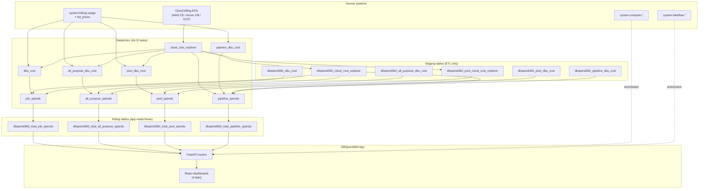

**Schema location:** `{catalog}.{schema}` — e.g. `dbspend360.03apr` (configured in `config/app.dev.config`).

---

## 3. Tab → table → API mapping

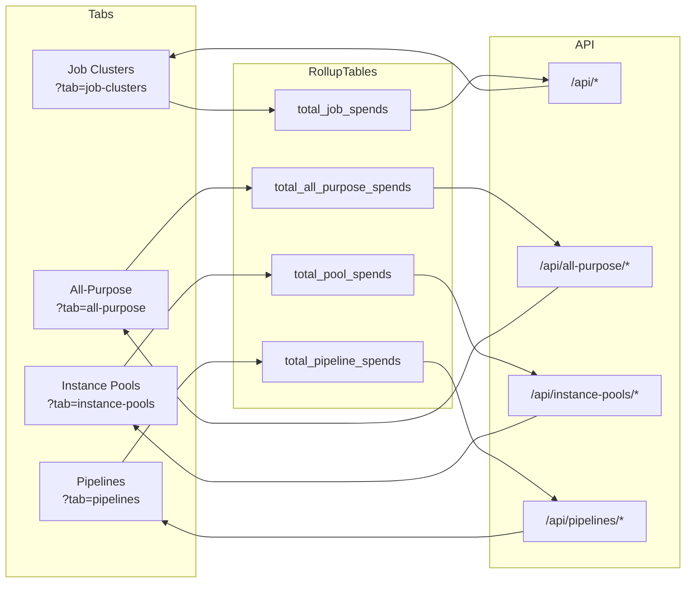

| Tab | Config key | Rollup table | API router | UI component |
|---|---|---|---|---|
| Job Clusters | `table_name` | `dbspend360_total_job_spends` | `server/routers/dashboard.py` | `JobClustersDashboard.tsx` |
| All-Purpose Clusters | `all_purpose_table_name` | `dbspend360_total_all_purpose_spends` | `server/routers/all_purpose.py` | `AllPurposeDashboard.tsx` |
| Instance Pools | `pool_table_name` | `dbspend360_total_pool_spends` | `server/routers/instance_pools.py` | `InstancePoolsDashboard.tsx` |
| Pipeline Compute | `pipeline_table_name` | `dbspend360_total_pipeline_spends` | `server/routers/pipelines.py` | `PipelineDashboard.tsx` |

---

## 4. Per-tab logical models

### 4.1 Job Clusters

**Scope:** Databricks jobs running on job clusters (`cluster_source = 'JOB'`, `job_run_id IS NOT NULL`).

**Grain:** `(cluster_id, job_id, run_id, usage_date)`

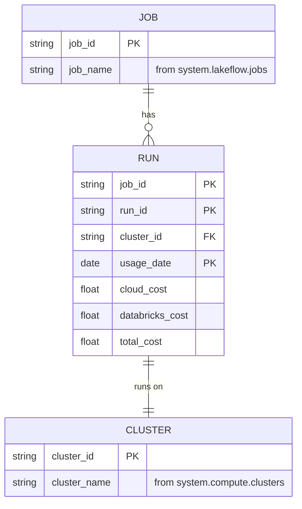

**UI hierarchy:** Job (grouped) → Runs (expandable rows) → Cost breakdown modal per run.

| Layer | Table | Key columns |
|---|---|---|
| DBU staging | `dbspend360_dbu_cost` | `cluster_id`, `job_id`, `run_id`, `usage_date`, `databricks_cost` |
| Cloud staging | `dbspend360_cloud_cost_explorer` | `cluster_id`, `cost_incurred_date`, `cloud_cost`, `compute_cost`, `storage_cost`, `network_cost`, `other_cost` |
| **Rollup (app)** | **`dbspend360_total_job_spends`** | All staging columns merged + `total_cost`, `currency` |

**Key API endpoints:**

| Endpoint | Purpose |
|---|---|
| `GET /api/grouped-job-spends` | Paginated job list with nested runs |
| `GET /api/summary` | Summary cards (total spend, cloud/DBU split) |
| `GET /api/job/{job_id}/breakdown` | Cloud vs DBU pie chart for a run |
| `GET /api/job/{job_id}/analyze` | AI cost recommendations |

**System table enrichment (request-time):**

- `system.lakeflow.jobs` — job names
- `system.lakeflow.job_run_timeline` — run history for AI analysis
- `system.compute.clusters` — cluster config for drill-down

---

### 4.2 All-Purpose Clusters

**Scope:** Interactive clusters started from the UI or API (`cluster_source IN ('UI','API')`, `job_run_id IS NULL`).

**Grain:** `(cluster_id, user_id, usage_date)`

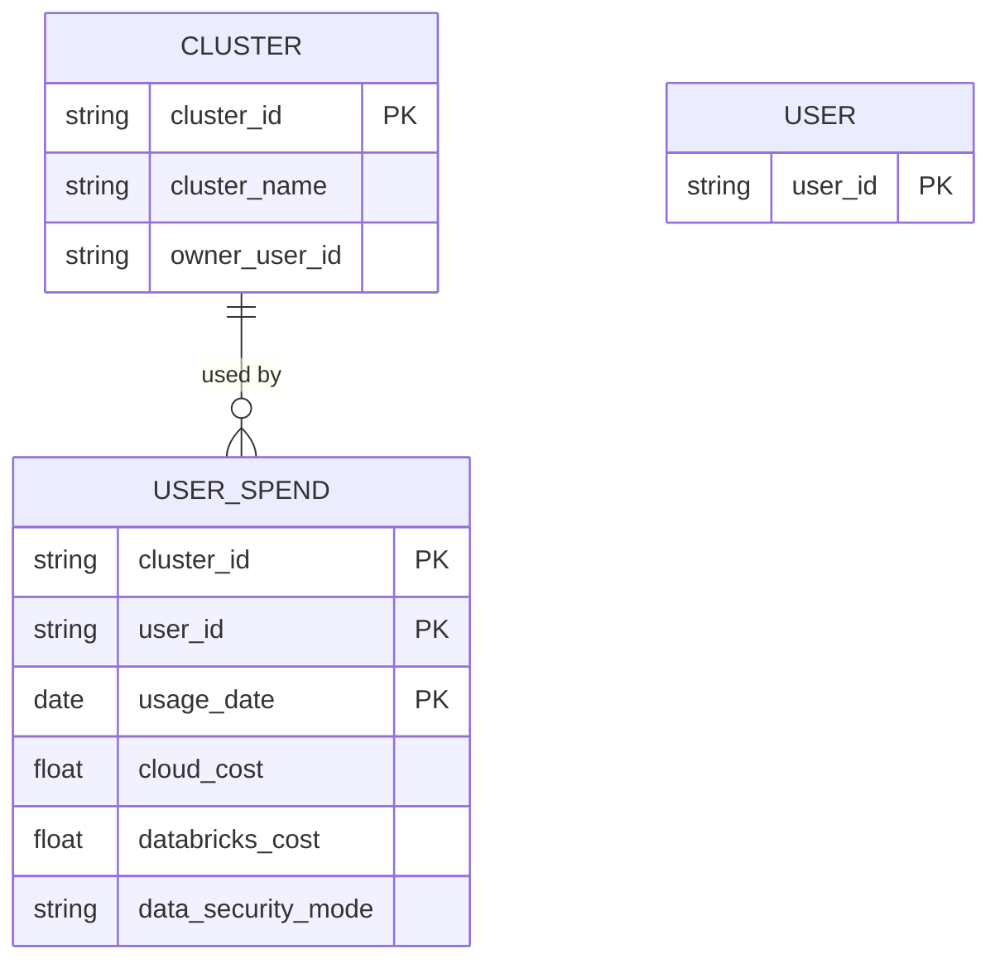

**UI views:** Two sub-tabs (`?subtab=by-cluster` or `?subtab=by-user`):

- **By Cluster** — clusters grouped, with nested user breakdown
- **By User** — users grouped, with nested cluster breakdown

| Layer | Table | Key columns |
|---|---|---|
| DBU staging | `dbspend360_all_purpose_dbu_cost` | `cluster_id`, `user_id`, `usage_date`, `databricks_cost`, `data_security_mode` |
| Cloud staging | `dbspend360_cloud_cost_explorer` | Same cluster explorer as Job Clusters |
| **Rollup (app)** | **`dbspend360_total_all_purpose_spends`** | Merged costs + `data_security_mode`, `total_cost` |

**Key API endpoints:**

| Endpoint | Purpose |
|---|---|
| `GET /api/all-purpose/grouped-by-cluster` | Cluster-centric view |
| `GET /api/all-purpose/grouped-by-user` | User-centric view |
| `GET /api/all-purpose/summary` | Summary cards |
| `GET /api/cluster/{cluster_id}/details` | Cluster config drill-down (shared) |

---

### 4.3 Instance Pools

**Scope:** Any compute backed by an instance pool (`instance_pool_id IS NOT NULL`).

**Grain:** `(instance_pool_id, cluster_id, usage_date)` — idle pool VMs use `cluster_id = '__pool_overhead__'`.

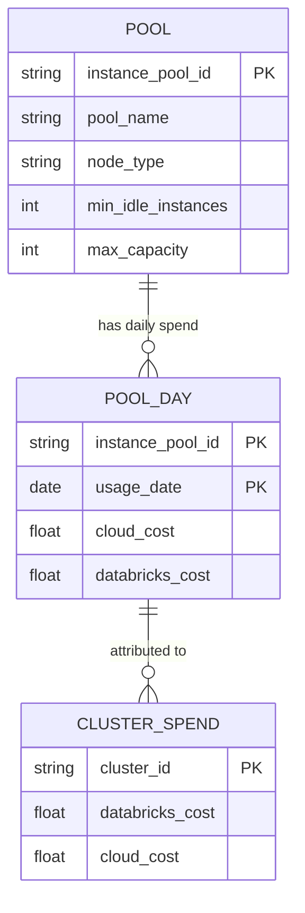

**UI hierarchy:** Pool (grouped) → Daily spend → Clusters using the pool (or `__pool_overhead__` for idle VMs).

| Layer | Table | Key columns |
|---|---|---|
| DBU staging | `dbspend360_pool_dbu_cost` | `instance_pool_id`, `cluster_id`, `usage_date`, `databricks_cost` |
| Cloud staging | `dbspend360_pool_cloud_cost_explorer` | `instance_pool_id`, `cost_incurred_date`, `cloud_cost` (joined on `DatabricksInstancePoolId` tag, **not** `cluster_id`) |
| **Rollup (app)** | **`dbspend360_total_pool_spends`** | Pool metadata denormalized (`pool_name`, `node_type`, `min_idle_instances`, `max_capacity`, snapshot badges) + costs |

**Key API endpoints:**

| Endpoint | Purpose |
|---|---|
| `GET /api/instance-pools/grouped` | Paginated pool list with daily breakdown |
| `GET /api/instance-pools/summary` | Summary cards |
| `GET /api/instance-pools/{pool_id}/details` | Pool config + cluster attribution |
| `GET /api/instance-pools/{pool_id}/analyze` | AI recommendations |

**System table enrichment:**

- `system.compute.instance_pools` — live pool metadata
- `system.compute.clusters` — cluster names in pool expansion

---

### 4.4 Pipeline Compute

**Scope:** DLT pipelines and related workloads (`dlt_pipeline_id IS NOT NULL` — includes DLT, DBSQL MVs, online tables, vector search, model serving, AI functions).

**Grain:** `(workspace_id, pipeline_id, usage_date, billing_origin_product)`

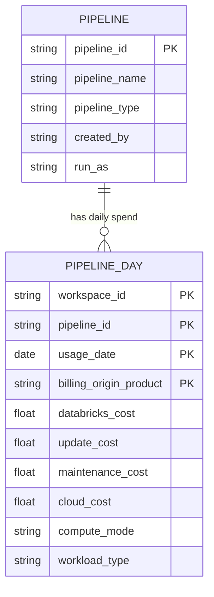

**Compute modes:**

| `compute_mode` | Meaning | Cloud cost source |
|---|---|---|
| `serverless` | No cluster (`cluster_id IS NULL` in staging) | `cloud_cost = NULL` (DBU only) |
| `classic` | Runs on a provisioned cluster | `dbspend360_cloud_cost_explorer` joined on `cluster_id` |
| `mixed` | Both modes in the same day | Partial cloud attribution |

**UI hierarchy:** Pipeline (grouped, collapsed across `billing_origin_product`) → Daily spend breakdown.

| Layer | Table | Key columns |
|---|---|---|
| DBU staging | `dbspend360_pipeline_dbu_cost` | `workspace_id`, `pipeline_id`, `usage_date`, `cluster_id`, `billing_origin_product`, `databricks_cost`, `update_cost`, `maintenance_cost`, `compute_mode` |
| Cloud staging | `dbspend360_cloud_cost_explorer` | Classic pipelines only — joined on `cluster_id` |
| **Rollup (app)** | **`dbspend360_total_pipeline_spends`** | Pipeline metadata (`pipeline_name`, `workload_type`, `compute_mode`, `cost_basis`, `metadata_missing`) + all cost columns |

**Key API endpoints:**

| Endpoint | Purpose |
|---|---|
| `GET /api/pipelines/grouped` | Paginated pipeline list |
| `GET /api/pipelines/summary` | Summary with serverless/classic/mixed splits |
| `GET /api/pipelines/{pipeline_id}/details` | Pipeline config + daily breakdown |
| `GET /api/pipelines/{pipeline_id}/analyze` | AI recommendations |

**System table enrichment:**

- `system.lakeflow.pipelines` — pipeline names and configuration

---

## 5. Complete table catalog

### 5.1 Rollup tables (read by the app)

These are the **only tables the FastAPI service queries** for tab data.

#### `dbspend360_total_job_spends`

| Column | Type | Description |
|---|---|---|
| `cluster_id` | STRING | Databricks cluster ID |
| `job_id` | STRING | Job ID |
| `run_id` | STRING | Job run ID |
| `usage_date` | DATE | Day of usage |
| `cloud_cost` | DOUBLE | Total cloud VM cost |
| `compute_cost` | DOUBLE | Cloud compute segment (EC2 / Azure Compute) |
| `storage_cost` | DOUBLE | Cloud storage segment (EBS / managed disks) |
| `network_cost` | DOUBLE | Cloud network segment |
| `other_cost` | DOUBLE | Other cloud services |
| `databricks_cost` | DOUBLE | DBU cost |
| `currency` | STRING | Currency code |
| `total_cost` | DOUBLE | `cloud_cost + databricks_cost` |
| `created_at` | TIMESTAMP | Row creation time |
| `updated_at` | TIMESTAMP | Last update time |

**Primary grain:** `(cluster_id, job_id, run_id, usage_date)`

---

#### `dbspend360_total_all_purpose_spends`

| Column | Type | Description |
|---|---|---|
| `cluster_id` | STRING | Databricks cluster ID |
| `user_id` | STRING | User who consumed DBUs |
| `usage_date` | DATE | Day of usage |
| `cloud_cost` | DOUBLE | Total cloud VM cost |
| `compute_cost` | DOUBLE | Cloud compute segment |
| `storage_cost` | DOUBLE | Cloud storage segment |
| `network_cost` | DOUBLE | Cloud network segment |
| `other_cost` | DOUBLE | Other cloud services |
| `databricks_cost` | DOUBLE | DBU cost |
| `currency` | STRING | Currency code |
| `total_cost` | DOUBLE | `cloud_cost + databricks_cost` |
| `data_security_mode` | STRING | Cluster security mode (e.g. `USER_ISOLATION`) |
| `created_at` | TIMESTAMP | Row creation time |
| `updated_at` | TIMESTAMP | Last update time |

**Primary grain:** `(cluster_id, user_id, usage_date)`

---

#### `dbspend360_total_pool_spends`

| Column | Type | Description |
|---|---|---|
| `instance_pool_id` | STRING | Instance pool ID |
| `cluster_id` | STRING | Cluster using the pool, or `__pool_overhead__` for idle VMs |
| `usage_date` | DATE | Day of usage |
| `workspace_id` | STRING | Workspace ID |
| `pool_name` | STRING | Pool display name (snapshot) |
| `node_type` | STRING | VM node type (snapshot) |
| `min_idle_instances` | BIGINT | Min idle instances (snapshot) |
| `max_capacity` | BIGINT | Max pool capacity (snapshot) |
| `idle_instance_autotermination_minutes` | BIGINT | Auto-termination setting (snapshot) |
| `pool_snapshot_missing` | BOOLEAN | True if pool metadata unavailable at ETL time |
| `pool_deleted_at` | TIMESTAMP | When pool was deleted (if applicable) |
| `databricks_cost` | DOUBLE | DBU cost |
| `cloud_cost` | DOUBLE | Cloud VM cost (from pool explorer) |
| `total_cost` | DOUBLE | `cloud_cost + databricks_cost` |
| `currency` | STRING | Currency code |
| `sku_name` | STRING | DBU SKU |
| `created_at` | TIMESTAMP | Row creation time |
| `updated_at` | TIMESTAMP | Last update time |

**Primary grain:** `(instance_pool_id, cluster_id, usage_date)`

---

#### `dbspend360_total_pipeline_spends`

| Column | Type | Description |
|---|---|---|
| `workspace_id` | STRING | Workspace ID (`pipeline_id` is unique per workspace) |
| `pipeline_id` | STRING | Pipeline ID |
| `usage_date` | DATE | Day of usage |
| `pipeline_name` | STRING | Pipeline display name (snapshot) |
| `pipeline_type` | STRING | Pipeline type (e.g. `WORKSPACE`, `DBSQL`) |
| `created_by` | STRING | Creator user |
| `run_as` | STRING | Run-as identity |
| `workload_type` | STRING | Workload category (DLT, MV, etc.) |
| `compute_mode` | STRING | `serverless`, `classic`, or `mixed` |
| `cost_basis` | STRING | How cost was attributed |
| `metadata_missing` | BOOLEAN | True if pipeline metadata unavailable |
| `pipeline_deleted_at` | TIMESTAMP | When pipeline was deleted |
| `databricks_cost` | DOUBLE | Total DBU cost |
| `update_cost` | DOUBLE | DBU cost for pipeline updates |
| `maintenance_cost` | DOUBLE | DBU cost for pipeline maintenance |
| `cloud_cost` | DOUBLE | Cloud VM cost (classic only; NULL for serverless) |
| `total_cost` | DOUBLE | `cloud_cost + databricks_cost` |
| `currency` | STRING | Currency code |
| `sku_name` | STRING | DBU SKU |
| `billing_origin_product` | STRING | Billing product origin (workload split) |
| `created_at` | TIMESTAMP | Row creation time |
| `updated_at` | TIMESTAMP | Last update time |

**Primary grain:** `(workspace_id, pipeline_id, usage_date, billing_origin_product)`

---

### 5.2 Staging tables (ETL only — not read by the app)

| Table | Grain | Written by |
|---|---|---|
| `dbspend360_dbu_cost` | `(cluster_id, job_id, run_id, usage_date)` | `dbspend360_dbu_cost_app` |
| `dbspend360_all_purpose_dbu_cost` | `(cluster_id, user_id, usage_date)` | `dbspend360_all_purpose_dbu_cost_app` |
| `dbspend360_pool_dbu_cost` | `(instance_pool_id, cluster_id, usage_date)` | `dbspend360_pool_dbu_cost_app` |
| `dbspend360_pipeline_dbu_cost` | `(workspace_id, pipeline_id, usage_date, cluster_id, billing_origin_product)` | `dbspend360_pipeline_dbu_cost_app` |
| `dbspend360_cloud_cost_explorer` | `(cluster_id, cost_incurred_date)` | `{aws,azure,gcp}_cloud_cost_explorer_app` |
| `dbspend360_pool_cloud_cost_explorer` | `(instance_pool_id, cost_incurred_date)` | Same explorer (pool `run_pool()` path) |
| `dbspend360_other_cost_breakdown` | `(cost_incurred_date, cluster_id, service_name)` | Cloud cost explorer |

### 5.3 Operational tables

| Table | Purpose | Read by app? |
|---|---|---|
| `dbspend360_audit_log` | ETL run status and row counts | Yes — coverage trend chart (Job tab) |
| `dbspend360_error_log` | Attribution mismatches and failures | No (ops only) |

---

## 6. ETL pipeline DAG

The Databricks Job (`jobs/resource_templates/DBSPEND360.yaml`) runs 9 tasks:

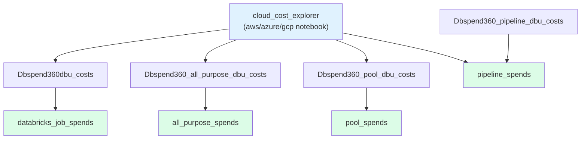

**Cloud cost explorer outputs:**

| Output table | Tag / join key | Used by |
|---|---|---|
| `dbspend360_cloud_cost_explorer` | `ClusterId` / `clusterid` | Job, All-Purpose, Pipeline (classic) |
| `dbspend360_pool_cloud_cost_explorer` | `DatabricksInstancePoolId` | Instance Pools |
| `dbspend360_other_cost_breakdown` | `cluster_id` | Job tab "Other costs" modal |

**DBU source filter per branch:**

| Branch | `system.billing.usage` filter |
|---|---|
| Job Clusters | `cluster_source = 'JOB'` AND `job_run_id IS NOT NULL` |
| All-Purpose | `cluster_source IN ('UI','API')` AND `job_run_id IS NULL` |
| Instance Pools | `instance_pool_id IS NOT NULL` |
| Pipeline Compute | `dlt_pipeline_id IS NOT NULL` |

---

## 7. Cross-tab cost model

The four tabs are **intentionally overlapping lenses**, not disjoint partitions of your bill.

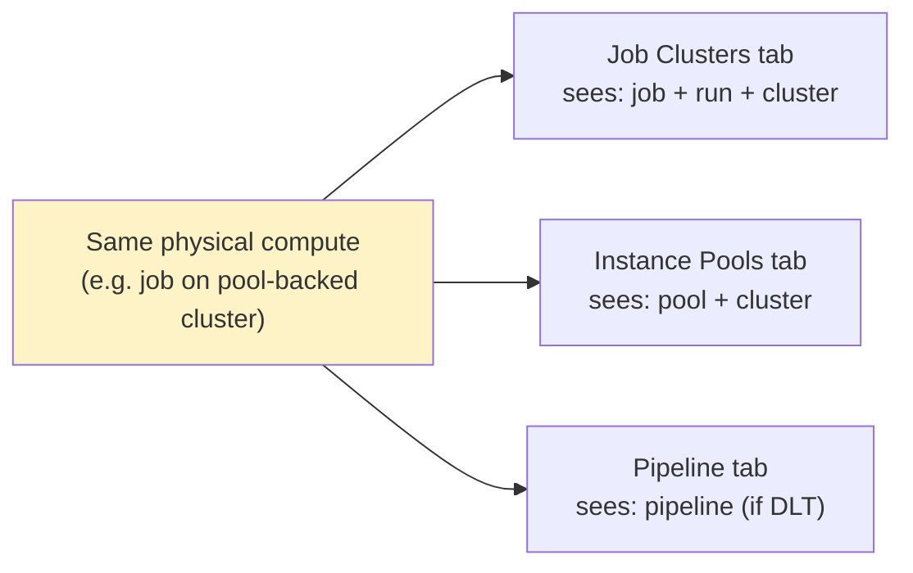

| Cost type | Overlap behavior |
|---|---|
| **DBU cost** | Can appear in multiple tabs (same DBUs, different grouping keys) |
| **Cloud cost (cluster explorer)** | Shared between Job, All-Purpose, and classic Pipeline tabs |
| **Cloud cost (pool explorer)** | Disjoint from cluster explorer — Instance Pools tab is additive, not double-counted with cluster tabs |

**Rule of thumb:** Use one tab per question. Don't sum tab totals.

---

## 8. App request flow

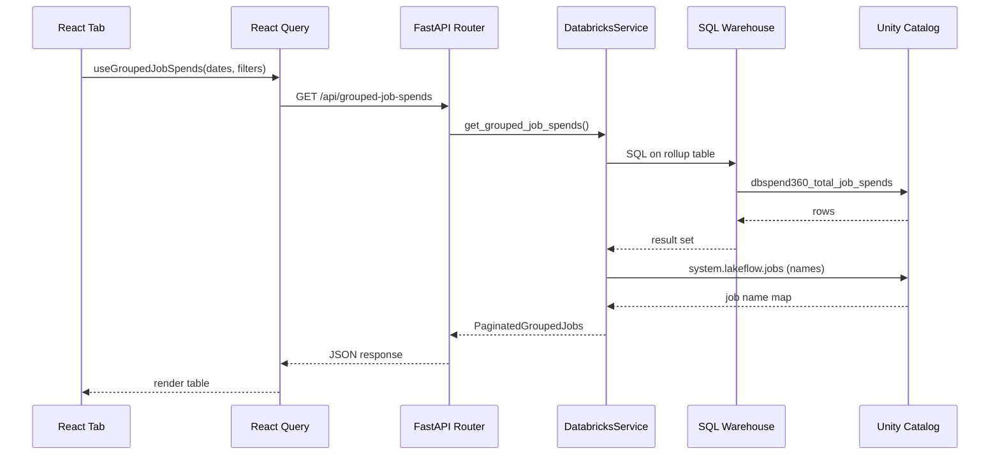

**Shared patterns across all tabs:**

1. User selects date range (presets: Today, This Week, This Month, Last 30 Days)
2. React Query fetches from the tab's API router
3. `DatabricksService` runs parameterized SQL against the rollup table
4. Optional system table joins enrich names and metadata
5. Pydantic models shape the response; frontend renders summary cards + grouped table
6. Drill-down modals call detail/analyze endpoints on row click

---

## 9. Cost column reference

Every rollup table shares a common cost vocabulary:

| Column | Meaning | Present in |
|---|---|---|
| `cloud_cost` | Total infrastructure (VM) cost from cloud billing | All tabs |
| `compute_cost` | Cloud compute segment (EC2, Azure Compute, GCE) | Job, All-Purpose |
| `storage_cost` | Cloud storage segment (EBS, managed disks) | Job, All-Purpose |
| `network_cost` | Cloud network segment | Job, All-Purpose |
| `other_cost` | Other cloud services | Job, All-Purpose |
| `databricks_cost` | DBU charges from Databricks billing | All tabs |
| `update_cost` | DBU for pipeline updates | Pipeline only |
| `maintenance_cost` | DBU for pipeline maintenance | Pipeline only |
| `total_cost` | `cloud_cost + databricks_cost` (null-safe) | All tabs |
| `currency` | ISO currency code | All tabs |

**Pool tab note:** `compute_cost`, `storage_cost`, `network_cost`, and `other_cost` are `NULL` for pool cloud cost — the pool explorer writes a single `cloud_cost` bucket (by design, to keep pool and cluster cloud costs disjoint).

---

## 10. Column-level lineage

**Diagrams first, tables second.** For lineage, a flow diagram is easier to scan than row-by-row text — you see sources, filters, joins, and targets in one pass. The compact **column legends** below each diagram hold the exact field mappings; open them when you need a specific column name.

**How to read the diagrams**

| Symbol | Meaning |
|---|---|
| Solid arrow | ETL data flow |
| Dashed arrow | App-time enrichment (not in rollup table) |
| Edge label | Filter, join key, or transform |
| Yellow box | Staging table |
| Green box | Rollup table (what the app queries) |

---

### 10.1 Shared patterns

Every tab shares the same DBU pricing path and the same date-window logic.

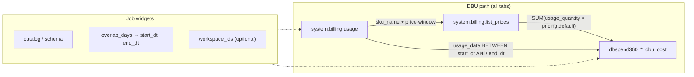

| Pattern | Detail |
|---|---|
| Date window | `get_date_window(audit_log, table, overlap_days)` — not a fixed calendar |
| DBU cost | `SUM(usage_quantity × list_prices.pricing.default)` |
| `sku_name` | `concat_ws(' + ', collect_set(usage.sku_name))` |
| `currency` | Constant `'USD'` in staging |
| Price join | Job + All-Purpose: **LEFT**; Pipeline: **INNER** (missing SKU = error) |

---

### 10.2 Cloud cost explorer (shared)

Two parallel explorers — cluster-tagged VMs vs pool-tagged VMs — stay **disjoint** by design.

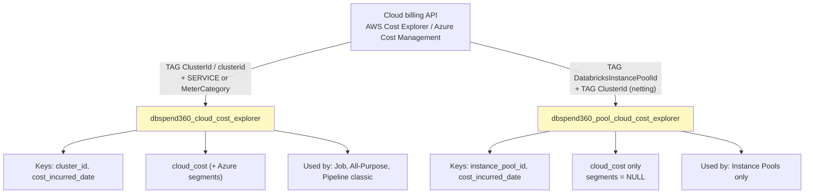

| Table | Key columns | Source → target | Filters |
|---|---|---|---|
| **Cluster explorer** | `cluster_id` | Cloud tag `ClusterId` / `clusterid` | AWS: EC2+EBS only; Azure: MeterCategory → compute/storage/network/other |
| | `cloud_cost` | `SUM(cost)` | Per `(cluster_id, date, currency)` |
| | `compute_cost` … `other_cost` | Azure `MeterCategory` buckets | **NULL on AWS** (single bucket) |
| **Pool explorer** | `instance_pool_id` | Cloud tag `DatabricksInstancePoolId` | **Netting:** drop rows that also have a cluster tag |
| | `cloud_cost` | `SUM(cost)` | Per `(instance_pool_id, date, currency)` |

---

### 10.3 Job Clusters tab

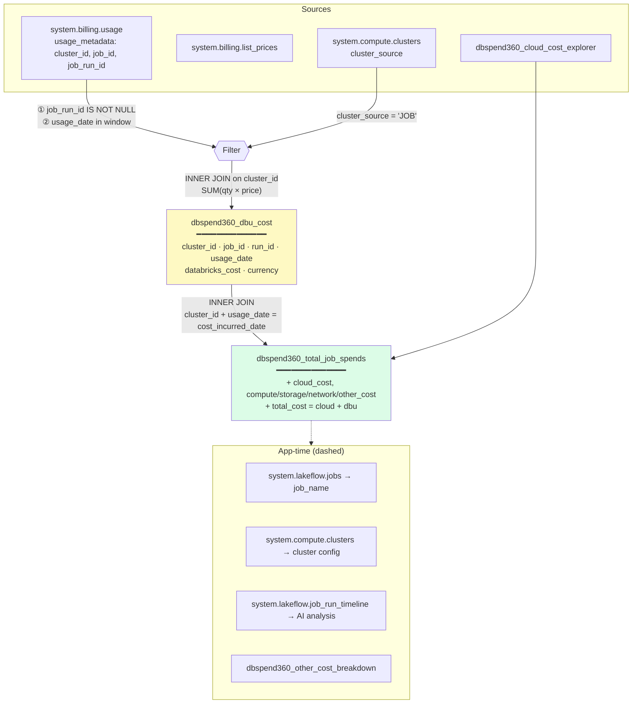

| Rollup column | From | Transform / join |
|---|---|---|
| **Keys** `cluster_id`, `job_id`, `run_id`, `usage_date` | `usage.usage_metadata.*` | `groupBy` after job-cluster filter |
| **DBU** `databricks_cost` | `usage` × `list_prices` | `SUM(qty × price)` |
| **Cloud** `cloud_cost`, segments | `cloud_cost_explorer` | INNER JOIN on `cluster_id` + date; no match → dropped + error log |
| **Derived** `total_cost` | `cloud_cost` + `databricks_cost` | `COALESCE(cloud,0) + COALESCE(dbu,0)` |
| **App only** `job_name` | `system.lakeflow.jobs.name` | Cached map at request time |

---

### 10.4 All-Purpose Clusters tab

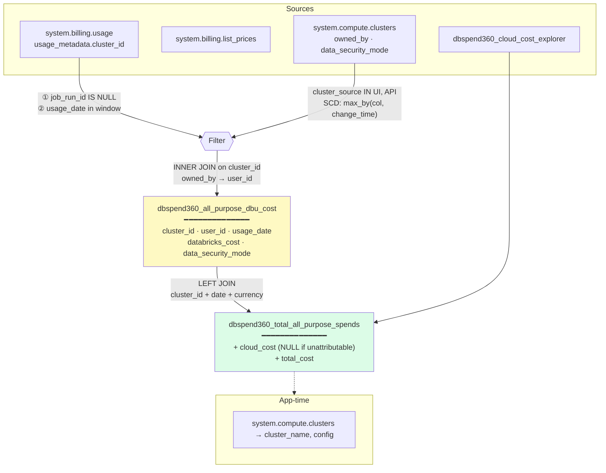

| Rollup column | From | Transform / join |
|---|---|---|
| **Keys** `cluster_id`, `user_id`, `usage_date` | `usage_metadata.cluster_id`, `clusters.owned_by` | `COALESCE(owned_by, '__unknown__')` |
| **DBU** `databricks_cost` | `usage` × `list_prices` | `SUM(qty × price)` |
| **Metadata** `data_security_mode` | `system.compute.clusters` | SCD-collapse per `cluster_id` |
| **Cloud** `cloud_cost` | `cloud_cost_explorer` | **LEFT JOIN** — NULL when pool-backed (no ClusterId tag) |
| **Derived** `total_cost` | cloud + dbu | Null-safe sum; cloud NULL still adds DBU |

---

### 10.5 Instance Pools tab

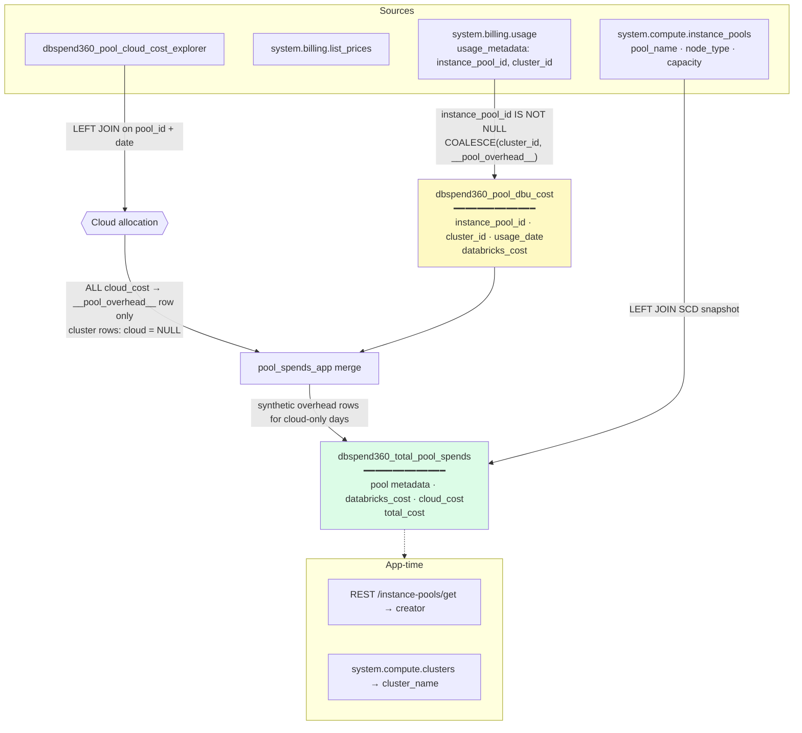

| Rollup column | From | Transform / join |
|---|---|---|
| **Keys** `instance_pool_id`, `cluster_id`, `usage_date` | `usage_metadata` | `__pool_overhead__` when `cluster_id` is NULL |
| **DBU** `databricks_cost` | `usage` × `list_prices` | On all rows; `0` on synthetic overhead-only rows |
| **Cloud** `cloud_cost` | `pool_cloud_cost_explorer` | Entire pool-day cloud on `__pool_overhead__` only |
| **Metadata** `pool_name`, `node_type`, `min/max capacity` | `system.compute.instance_pools` | SCD `max_by`; `pool_snapshot_missing` if no match |
| **Derived** `total_cost` | cloud + dbu | Null-safe sum |

---

### 10.6 Pipeline Compute tab

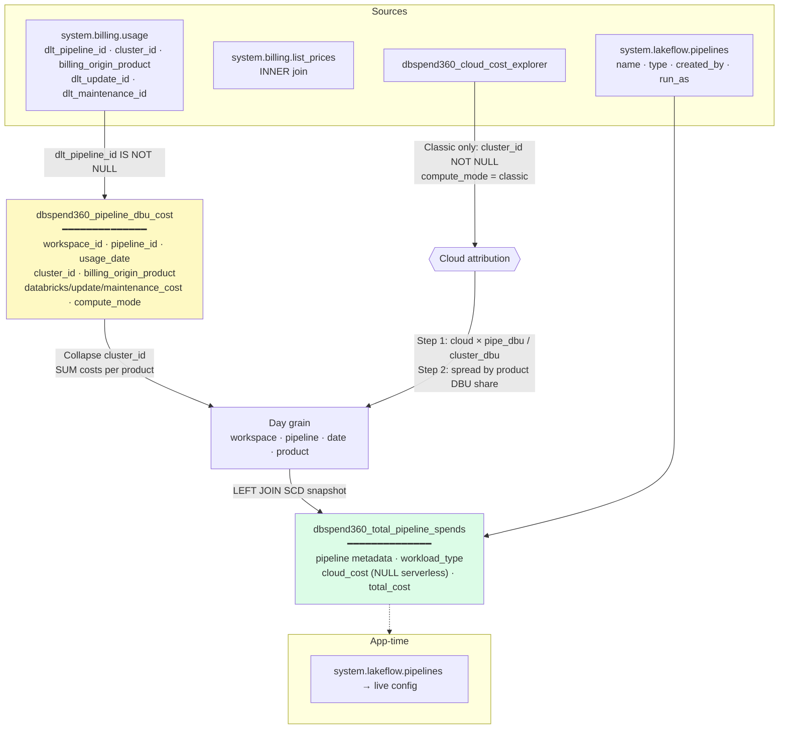

| Rollup column | From | Transform / join |
|---|---|---|
| **Keys** `workspace_id`, `pipeline_id`, `usage_date`, `billing_origin_product` | `usage` metadata + `billing_origin_product` | Staging grain collapses `cluster_id` |
| **DBU** `databricks_cost`, `update_cost`, `maintenance_cost` | `usage` × `list_prices` | Split by `dlt_update_id` / `dlt_maintenance_id` |
| **Mode** `compute_mode` | `cluster_id`, `sku_name`, product | `serverless` if NULL cluster, SERVERLESS SKU, or MS/VS/AI product |
| **Mode** `cost_basis` | `compute_mode` | `full` / `dbu_only` / `partial` |
| **Label** `workload_type` | `billing_origin_product` | `WORKLOAD_MAP` (DLT→DLT Pipeline, SQL→DBSQL MV, …) |
| **Cloud** `cloud_cost` | `cloud_cost_explorer` | Proportional DBU-weighted split; **NULL** for serverless |
| **Metadata** `pipeline_name`, `pipeline_type`, `created_by`, `run_as` | `system.lakeflow.pipelines` | SCD latest row; `metadata_missing` if absent |
| **Derived** `total_cost` | cloud + dbu | Null-safe sum |

**`WORKLOAD_MAP`:** `DLT`→DLT Pipeline · `SQL`→DBSQL MV · `DATABASE`→Online Table · `VECTOR_SEARCH` · `MODEL_SERVING` · `AI_FUNCTIONS`

---

### 10.7 All tabs at a glance

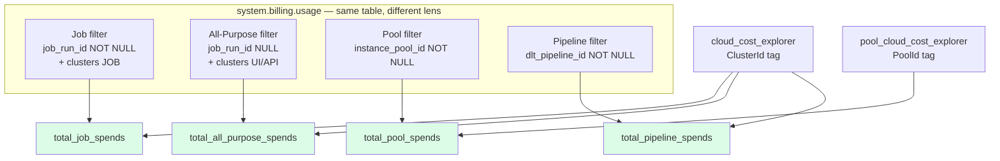

| Source system | Consumed by |
|---|---|
| `system.billing.usage` + `list_prices` | All four tabs (different metadata filters) |
| `system.compute.clusters` | Job (filter), All-Purpose (filter + denorm), app drill-down |
| `system.compute.instance_pools` | Instance Pools rollup metadata |
| `system.lakeflow.pipelines` | Pipeline rollup metadata |
| `system.lakeflow.jobs` | Job tab `job_name` (app-time) |
| Cloud billing API | Cluster + pool explorer staging tables |

---

## 11. File reference

| Concern | Location |
|---|---|
| Tab shell & routing | `client/src/components/Dashboard.tsx` |
| API response models | `server/models/job_spend.py` |
| SQL queries & table access | `server/services/databricks_service.py` |
| Job Clusters API | `server/routers/dashboard.py` |
| All-Purpose API | `server/routers/all_purpose.py` |
| Instance Pools API | `server/routers/instance_pools.py` |
| Pipeline API | `server/routers/pipelines.py` |
| Table config | `config/app.dev.config` |
| DDL definitions | `jobs/ddls/*.ipynb` |
| ETL notebooks | `jobs/notebooks/*_app.ipynb` |
| Job DAG | `jobs/resource_templates/DBSPEND360.yaml` |
| Product requirements | `docs/product.md` |
| Cost attribution deep-dive | `README.md` §4–5 |
