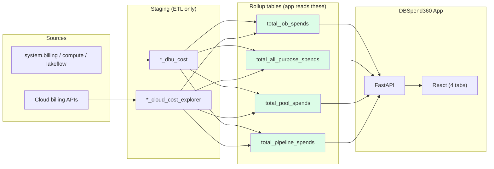
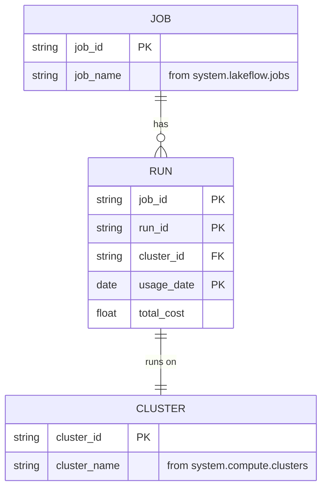
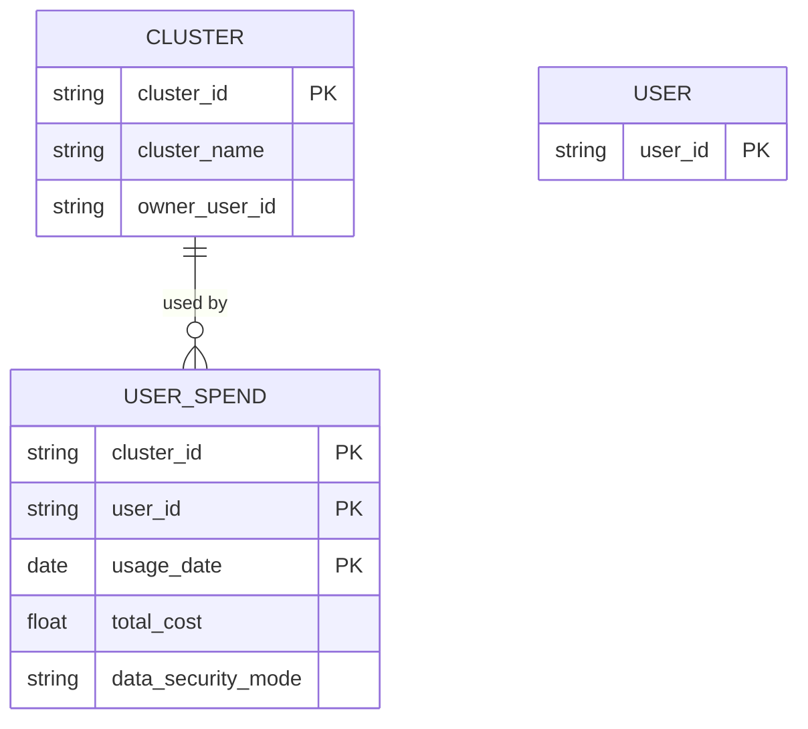
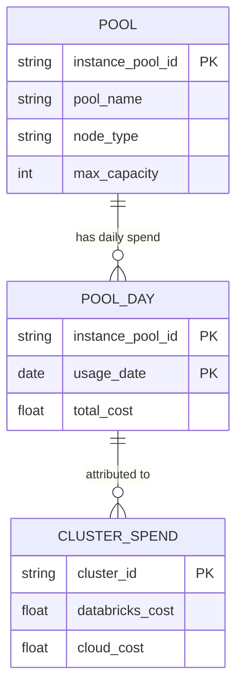
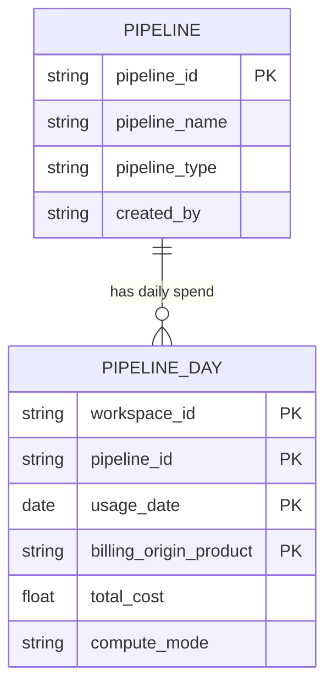
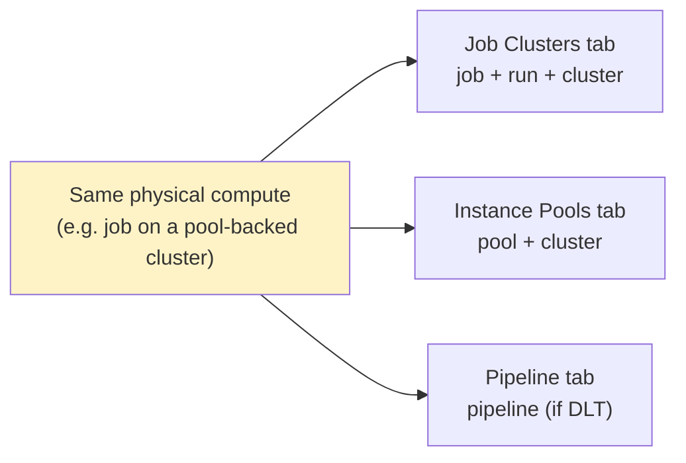

# DBSpend360 Data Model

The entities, grain, keys, and relationships behind DBSpend360's four cost tabs — the map you need to understand the data in five minutes.

> **Need the deep detail?** Full column catalog, ETL DAG, request flow, and column-level lineage live in [`data_model_reference.md`](./data_model_reference.md).

---

## 1. What the model represents

DBSpend360 answers one question four ways: **how much did our Databricks compute cost, and where did the money go?**

Each tab is a **cost lens** on the same underlying compute — one rollup table per lens:

| Tab | Question it answers | Primary entity | Rollup table |
|---|---|---|---|
| **Job Clusters** | How much do scheduled jobs cost? | Job → Run → Cluster | `dbspend360_total_job_spends` |
| **All-Purpose Clusters** | How much do interactive clusters cost, and who used them? | Cluster → User | `dbspend360_total_all_purpose_spends` |
| **Instance Pools** | How much do shared VM pools cost, including idle capacity? | Pool → Cluster | `dbspend360_total_pool_spends` |
| **Pipeline Compute** | How much do DLT / pipeline workloads cost? | Pipeline → Day | `dbspend360_total_pipeline_spends` |

Every tab combines two cost types:

- **Cloud cost** — VM infrastructure billed by AWS, Azure, or GCP
- **Databricks cost** — DBU charges from `system.billing.usage`

> **Read this once:** The four tabs **overlap by design** (see [§4](#4-cross-tab-cost-model)). The same compute can appear in multiple tabs. Tab totals do **not** sum to your cloud bill.

**Schema location:** `{catalog}.{schema}` — e.g. `dbspend360.03apr` (set in `config/app.dev.config`).

---

## 2. How the pieces fit together

The app reads **only the four green rollup tables**. Everything upstream is ETL plumbing (detailed in the [reference](./data_model_reference.md#2-etl-pipeline-dag)).

### Tab → table → API mapping

| Tab | Config key | Rollup table | API router | UI component |
|---|---|---|---|---|
| Job Clusters | `table_name` | `dbspend360_total_job_spends` | `server/routers/dashboard.py` | `JobClustersDashboard.tsx` |
| All-Purpose Clusters | `all_purpose_table_name` | `dbspend360_total_all_purpose_spends` | `server/routers/all_purpose.py` | `AllPurposeDashboard.tsx` |
| Instance Pools | `pool_table_name` | `dbspend360_total_pool_spends` | `server/routers/instance_pools.py` | `InstancePoolsDashboard.tsx` |
| Pipeline Compute | `pipeline_table_name` | `dbspend360_total_pipeline_spends` | `server/routers/pipelines.py` | `PipelineDashboard.tsx` |

---

## 3. The four entities

Each tab has one rollup table with a distinct **grain** (the unique key). The ER diagrams below show the *conceptual* entities and how they relate — physically, each tab is a **single denormalized rollup table**, one row per grain, not the multiple joined tables the diagram might suggest. Full column lists are in the [reference catalog](./data_model_reference.md#1-complete-table-catalog).

### 3.1 Job Clusters — grain `(cluster_id, job_id, run_id, usage_date)`

Scheduled jobs on job clusters (`cluster_source = 'JOB'`, `job_run_id IS NOT NULL`). **UI:** Job → Runs → per-run cost breakdown.

*Grain example:* one job that runs twice on the same day produces **two rows** in `total_job_spends` (same `job_id`, different `run_id`). Cross a day boundary and you get more rows, one per `usage_date`.

### 3.2 All-Purpose Clusters — grain `(cluster_id, user_id, usage_date)`

Interactive clusters (`cluster_source IN ('UI','API')`, `job_run_id IS NULL`). **UI:** two sub-tabs — *By Cluster* and *By User*.

### 3.3 Instance Pools — grain `(instance_pool_id, cluster_id, usage_date)`

Any compute backed by a pool (`instance_pool_id IS NOT NULL`). Idle pool VMs use `cluster_id = '__pool_overhead__'`. **UI:** Pool → daily spend → clusters using the pool.

### 3.4 Pipeline Compute — grain `(workspace_id, pipeline_id, usage_date, billing_origin_product)`

DLT pipelines and related workloads (`dlt_pipeline_id IS NOT NULL`). `compute_mode` is `serverless` (DBU only), `classic` (has cloud cost), or `mixed`. **UI:** Pipeline → daily spend breakdown.

---

## 4. Cross-tab cost model

The four tabs are **intentionally overlapping lenses**, not disjoint slices of your bill.

| Cost type | Overlap behavior |
|---|---|
| **DBU cost** | Can appear in multiple tabs (same DBUs, different grouping keys) |
| **Cloud cost (cluster explorer)** | Shared between Job, All-Purpose, and classic Pipeline tabs |
| **Cloud cost (pool explorer)** | Disjoint from cluster explorer — Instance Pools is additive, never double-counted |

**Rule of thumb:** use one tab per question; don't sum tab totals.

---

## 5. Cost column glossary

Every rollup table shares a common cost vocabulary:

| Column | Meaning | Present in |
|---|---|---|
| `cloud_cost` | Total infrastructure (VM) cost from cloud billing | All tabs |
| `compute_cost` | Cloud compute segment (EC2, Azure Compute, GCE) | Job, All-Purpose |
| `storage_cost` | Cloud storage segment (EBS, managed disks) | Job, All-Purpose |
| `network_cost` | Cloud network segment | Job, All-Purpose |
| `other_cost` | Other cloud services | Job, All-Purpose |
| `databricks_cost` | DBU charges from Databricks billing | All tabs |
| `update_cost` | DBU for pipeline updates | Pipeline only |
| `maintenance_cost` | DBU for pipeline maintenance | Pipeline only |
| `total_cost` | `cloud_cost + databricks_cost` (null-safe) | All tabs |
| `currency` | ISO currency code | All tabs |

**Pool note:** `compute/storage/network/other_cost` are `NULL` for pool cloud cost — the pool explorer writes a single `cloud_cost` bucket to keep pool and cluster cloud costs disjoint.

---

## 6. Go deeper

For anything below the level of "entities and relationships," see **[`data_model_reference.md`](./data_model_reference.md)**:

| You need… | Section |
|---|---|
| Every column, type, and description | [§1 Complete table catalog](./data_model_reference.md#1-complete-table-catalog) |
| The 9-task ETL job and its filters | [§2 ETL pipeline DAG](./data_model_reference.md#2-etl-pipeline-dag) |
| How a tab fetches and renders data | [§3 App request flow](./data_model_reference.md#3-app-request-flow) |
| Which source column feeds each target column | [§4 Column-level lineage](./data_model_reference.md#4-column-level-lineage) |
| API endpoints & system-table enrichment | [§5 Per-tab API endpoints & enrichment](./data_model_reference.md#5-per-tab-api-endpoints--enrichment) |
| Where each concern lives in the repo | [§6 File reference](./data_model_reference.md#6-file-reference) |
