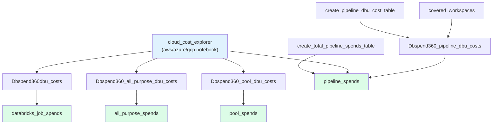
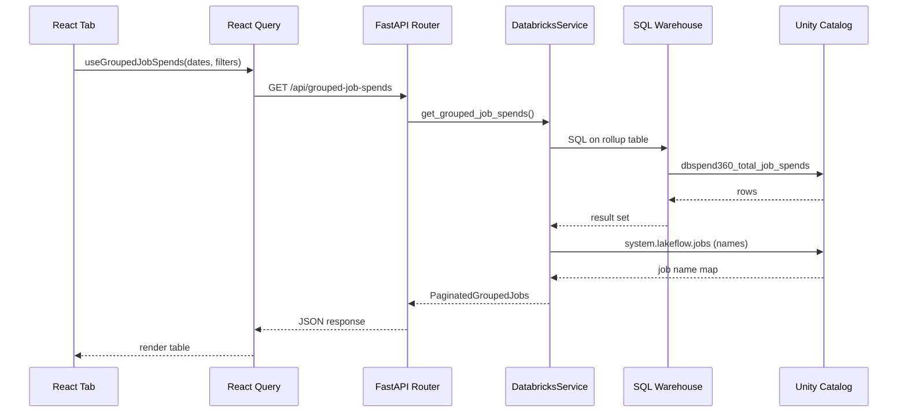
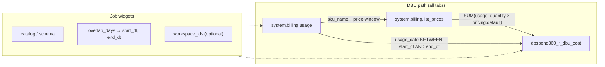
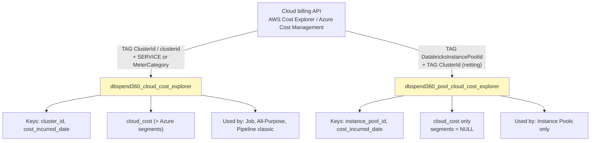
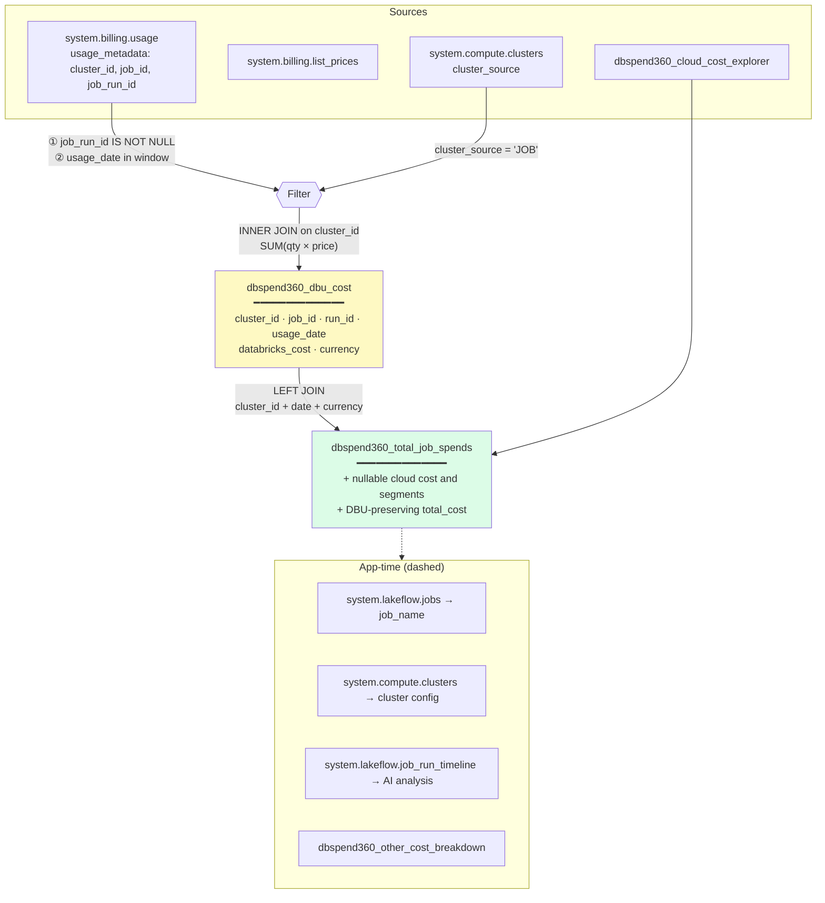
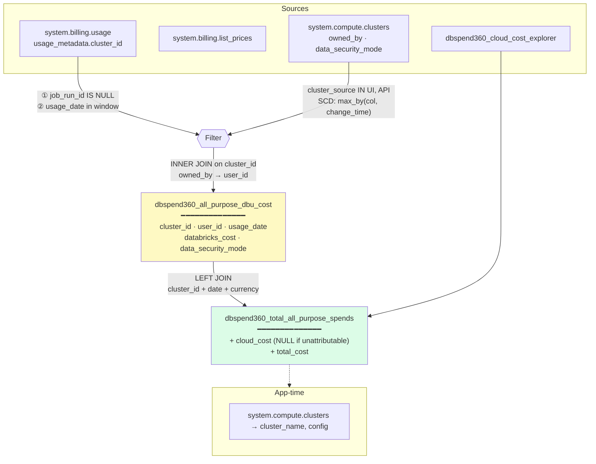
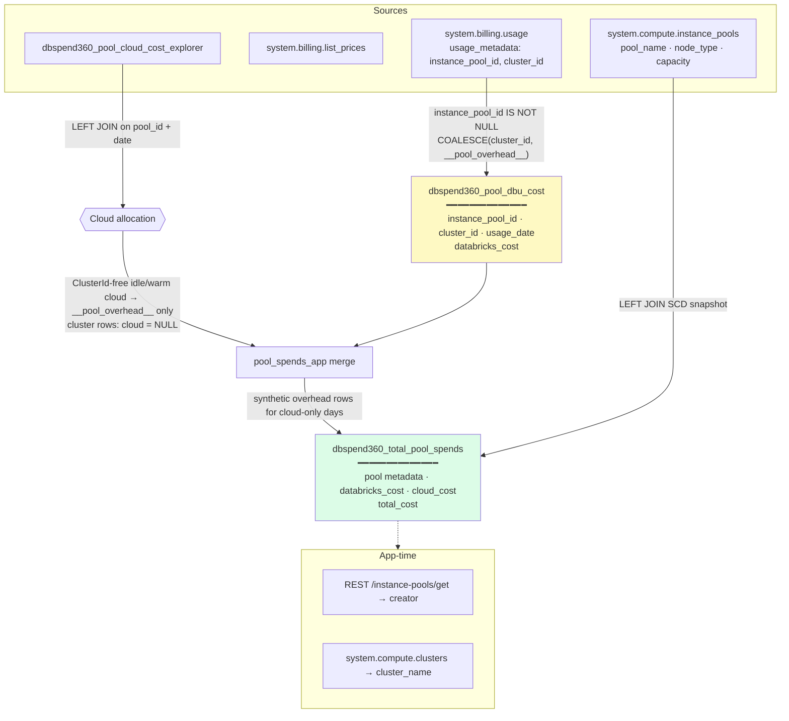
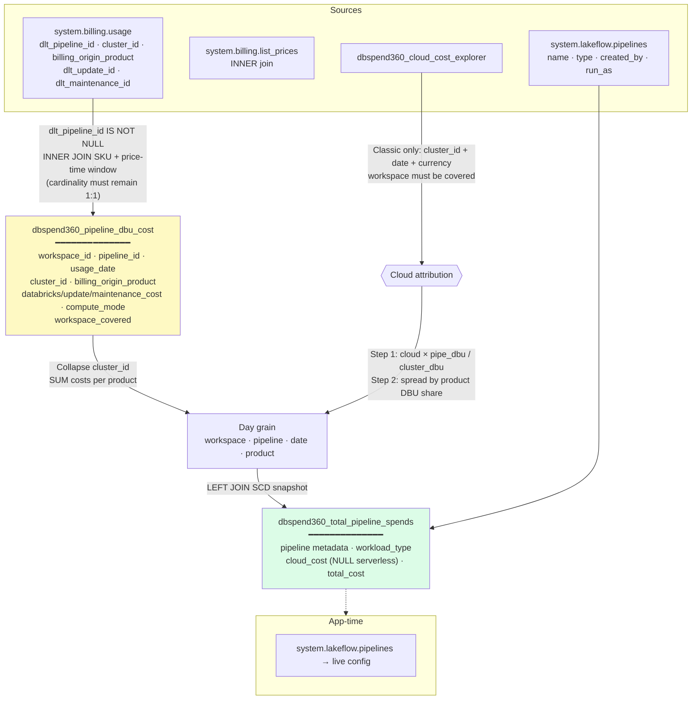
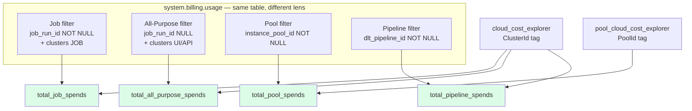

# DBSpend360 Data Model — Reference

Deep reference for the DBSpend360 data model. **Start with [`data_model.md`](./data_model.md)** for the entities, grain, and relationships — this file holds the exhaustive detail you open only when you need it:

- [§1 Complete table catalog](#1-complete-table-catalog) — every column, type, and description
- [§2 ETL pipeline DAG](#2-etl-pipeline-dag) — the 9-task job and its filters
- [§3 App request flow](#3-app-request-flow) — how a tab fetches data
- [§4 Column-level lineage](#4-column-level-lineage) — which source column feeds each target column
- [§5 Per-tab API endpoints & enrichment](#5-per-tab-api-endpoints--enrichment)
- [§6 File reference](#6-file-reference) — where each concern lives in the repo

---

## 1. Complete table catalog

### 1.1 Rollup tables (read by the app)

These are the **only tables the FastAPI service queries** for tab data.

#### `dbspend360_total_job_spends`

| Column | Type | Description |
|---|---|---|
| `cluster_id` | STRING | Databricks cluster ID |
| `job_id` | STRING | Job ID |
| `run_id` | STRING | Job run ID |
| `usage_date` | DATE | Day of usage |
| `cloud_cost` | DOUBLE | Total cloud VM cost; NULL when cloud cost is unavailable or unattributable |
| `compute_cost` | DOUBLE | Cloud compute segment (EC2 / Azure Compute) |
| `storage_cost` | DOUBLE | Cloud storage segment (EBS / managed disks) |
| `network_cost` | DOUBLE | Cloud network segment |
| `other_cost` | DOUBLE | Other cloud services |
| `databricks_cost` | DOUBLE | DBU cost |
| `currency` | STRING | Currency code |
| `workspace_covered` | BOOLEAN | Whether the workspace is inside the configured cloud-billing scope |
| `total_cost` | DOUBLE | `COALESCE(cloud_cost, 0) + COALESCE(databricks_cost, 0)` |
| `created_at` | TIMESTAMP | Row creation time |
| `updated_at` | TIMESTAMP | Last update time |

**Primary grain:** `(cluster_id, job_id, run_id, usage_date)`

---

#### `dbspend360_total_all_purpose_spends`

| Column | Type | Description |
|---|---|---|
| `cluster_id` | STRING | Databricks cluster ID |
| `user_id` | STRING | User who consumed DBUs |
| `usage_date` | DATE | Day of usage |
| `cloud_cost` | DOUBLE | Total cloud VM cost |
| `compute_cost` | DOUBLE | Cloud compute segment |
| `storage_cost` | DOUBLE | Cloud storage segment |
| `network_cost` | DOUBLE | Cloud network segment |
| `other_cost` | DOUBLE | Other cloud services |
| `databricks_cost` | DOUBLE | DBU cost |
| `currency` | STRING | Currency code |
| `total_cost` | DOUBLE | `cloud_cost + databricks_cost` |
| `data_security_mode` | STRING | Cluster security mode (e.g. `USER_ISOLATION`) |
| `created_at` | TIMESTAMP | Row creation time |
| `updated_at` | TIMESTAMP | Last update time |

**Primary grain:** `(cluster_id, user_id, usage_date)`

---

#### `dbspend360_total_pool_spends`

| Column | Type | Description |
|---|---|---|
| `instance_pool_id` | STRING | Instance pool ID |
| `cluster_id` | STRING | Cluster using the pool, or `__pool_overhead__` for idle VMs |
| `usage_date` | DATE | Day of usage |
| `workspace_id` | STRING | Workspace ID |
| `pool_name` | STRING | Pool display name (snapshot) |
| `node_type` | STRING | VM node type (snapshot) |
| `min_idle_instances` | BIGINT | Min idle instances (snapshot) |
| `max_capacity` | BIGINT | Max pool capacity (snapshot) |
| `idle_instance_autotermination_minutes` | BIGINT | Auto-termination setting (snapshot) |
| `pool_snapshot_missing` | BOOLEAN | True if pool metadata unavailable at ETL time |
| `pool_deleted_at` | TIMESTAMP | When pool was deleted (if applicable) |
| `databricks_cost` | DOUBLE | DBU cost |
| `cloud_cost` | DOUBLE | ClusterId-free idle/warm VM cost from the pool explorer; active pool-backed VM cost stays on the cluster lens |
| `total_cost` | DOUBLE | `cloud_cost + databricks_cost` |
| `currency` | STRING | Currency code |
| `sku_name` | STRING | DBU SKU |
| `workspace_covered` | BOOLEAN | Whether the workspace is inside the configured cloud-billing scope |
| `created_at` | TIMESTAMP | Row creation time |
| `updated_at` | TIMESTAMP | Last update time |

**Primary grain:** `(instance_pool_id, cluster_id, usage_date)`

---

#### `dbspend360_total_pipeline_spends`

| Column | Type | Description |
|---|---|---|
| `workspace_id` | STRING | Workspace ID (`pipeline_id` is unique per workspace) |
| `pipeline_id` | STRING | Pipeline ID |
| `usage_date` | DATE | Day of usage |
| `pipeline_name` | STRING | Pipeline display name (snapshot) |
| `pipeline_type` | STRING | Pipeline type (e.g. `WORKSPACE`, `DBSQL`) |
| `created_by` | STRING | Creator user |
| `run_as` | STRING | Run-as identity |
| `workload_type` | STRING | Workload category (DLT, MV, etc.) |
| `compute_mode` | STRING | `serverless`, `classic`, or `mixed` |
| `cost_basis` | STRING | How cost was attributed |
| `metadata_missing` | BOOLEAN | True if pipeline metadata unavailable |
| `pipeline_deleted_at` | TIMESTAMP | When pipeline was deleted |
| `databricks_cost` | DOUBLE | Total DBU cost |
| `update_cost` | DOUBLE | DBU cost for pipeline updates |
| `maintenance_cost` | DOUBLE | DBU cost for pipeline maintenance |
| `cloud_cost` | DOUBLE | Cloud VM cost (classic only; NULL for serverless) |
| `total_cost` | DOUBLE | `COALESCE(cloud_cost, 0) + COALESCE(databricks_cost, 0)` |
| `currency` | STRING | Currency code |
| `sku_name` | STRING | DBU SKU |
| `billing_origin_product` | STRING | Billing product origin (workload split) |
| `workspace_covered` | BOOLEAN | Whether cloud billing covers this workspace; uncovered rows keep known DBU spend and have no attributable cloud cost |
| `created_at` | TIMESTAMP | Row creation time |
| `updated_at` | TIMESTAMP | Last update time |

**Primary grain:** `(workspace_id, pipeline_id, usage_date, billing_origin_product)`

---

#### `dbspend360_total_sql_warehouse_spends`

| Column | Type | Description |
|---|---|---|
| `warehouse_id` | STRING | Account-unique SQL warehouse ID |
| `usage_date` | DATE | Day of SQL warehouse usage |
| `warehouse_name` | STRING | Latest known name, with ID fallback |
| `warehouse_type` | STRING | `SERVERLESS`, `PRO`, `CLASSIC`, or system-table type |
| `warehouse_size` | STRING | Latest known warehouse size |
| `metadata_missing` | BOOLEAN | No system warehouse snapshot was available |
| `databricks_cost` | DOUBLE | List-price DBU spend |
| `total_cost` | DOUBLE | Stored DBU amount; economically complete only for Serverless |
| `workspace_id` | STRING | Workspace used for coverage classification |
| `workspace_covered` | BOOLEAN | Whether the workspace is in cloud-billing scope |

**Primary grain:** `(warehouse_id, usage_date)`

Classic/Pro customer-cloud VM, disk, and network charges are not currently
attributed to `warehouse_id`; API/UI cost basis must therefore label those rows
DBU-only. Serverless DBU includes infrastructure.

---

### 1.2 Staging tables (ETL only — not read by the app)

| Table | Grain | Written by |
|---|---|---|
| `dbspend360_dbu_cost` | `(cluster_id, job_id, run_id, usage_date)` | `dbspend360_dbu_cost_app` |
| `dbspend360_all_purpose_dbu_cost` | `(cluster_id, user_id, usage_date)` | `dbspend360_all_purpose_dbu_cost_app` |
| `dbspend360_pool_dbu_cost` | `(instance_pool_id, cluster_id, usage_date)` | `dbspend360_pool_dbu_cost_app` |
| `dbspend360_pipeline_dbu_cost` | `(workspace_id, pipeline_id, usage_date, cluster_id, billing_origin_product)` | `dbspend360_pipeline_dbu_cost_app` |
| `dbspend360_sql_warehouse_dbu_cost` | `(warehouse_id, usage_date)` | `dbspend360_sql_warehouse_dbu_cost_app` |
| `dbspend360_cloud_cost_explorer` | `(cluster_id, cost_incurred_date)` | `{aws,azure,gcp}_cloud_cost_explorer_app` |
| `dbspend360_pool_cloud_cost_explorer` | `(instance_pool_id, cost_incurred_date)` | Same explorer (pool `run_pool()` path) |
| `dbspend360_other_cost_breakdown` | `(cost_incurred_date, cluster_id, service_name)` | Cloud cost explorer |

### 1.3 Operational tables

| Table | Purpose | Read by app? |
|---|---|---|
| `dbspend360_audit_log` | ETL run status and row counts | Yes — coverage trend chart (Job tab) |
| `dbspend360_error_log` | Attribution mismatches and failures | No (ops only) |

---

## 2. ETL pipeline DAG

The Databricks Job (`jobs/resource_templates/DBSPEND360.yaml`) declares table
creation as explicit prerequisites instead of assuming the pipeline tables
already exist:

**Cloud cost explorer outputs:**

| Output table | Tag / join key | Used by |
|---|---|---|
| `dbspend360_cloud_cost_explorer` | `ClusterId` / `clusterid` | Job, All-Purpose, Pipeline (classic) |
| `dbspend360_pool_cloud_cost_explorer` | `DatabricksInstancePoolId` | Instance Pools |
| `dbspend360_other_cost_breakdown` | `cluster_id` | Job tab "Other costs" modal |

**DBU source filter per branch:**

| Branch | `system.billing.usage` filter |
|---|---|
| Job Clusters | `cluster_source = 'JOB'` AND `job_run_id IS NOT NULL` |
| All-Purpose | `cluster_source IN ('UI','API')` AND `job_run_id IS NULL` |
| Instance Pools | `instance_pool_id IS NOT NULL` |
| Pipeline Compute | `dlt_pipeline_id IS NOT NULL` |

---

## 3. App request flow

**Shared patterns across all tabs:**

1. User selects date range (presets: Today, This Week, This Month, Last 30 Days)
2. React Query fetches from the tab's API router
3. `DatabricksService` runs parameterized SQL against the rollup table
4. Optional system table joins enrich names and metadata
5. Pydantic models shape the response; frontend renders summary cards + grouped table
6. Drill-down modals call detail/analyze endpoints on row click

---

## 4. Column-level lineage

**Diagrams first, tables second.** For lineage, a flow diagram is easier to scan than row-by-row text — you see sources, filters, joins, and targets in one pass. The compact **column legends** below each diagram hold the exact field mappings; open them when you need a specific column name.

**How to read the diagrams**

| Symbol | Meaning |
|---|---|
| Solid arrow | ETL data flow |
| Dashed arrow | App-time enrichment (not in rollup table) |
| Edge label | Filter, join key, or transform |
| Yellow box | Staging table |
| Green box | Rollup table (what the app queries) |

---

### 4.1 Shared patterns

Every tab shares the same DBU pricing path and the same date-window logic.

| Pattern | Detail |
|---|---|
| Date window | `get_date_window(audit_log, table, overlap_days)` — not a fixed calendar |
| DBU cost | `SUM(usage_quantity × list_prices.pricing.default)` |
| `sku_name` | `concat_ws(' + ', collect_set(usage.sku_name))` |
| `currency` | Constant `'USD'` in staging |
| Price join | Job + All-Purpose: **LEFT**; Pipeline: **INNER** (missing SKU = error) |

---

### 4.2 Cloud cost explorer (shared)

Two parallel explorers — cluster-tagged VMs vs pool-tagged VMs — stay **disjoint** by design.

| Table | Key columns | Source → target | Filters |
|---|---|---|---|
| **Cluster explorer** | `cluster_id` | Cloud tag `ClusterId` / `clusterid` | AWS: EC2+EBS only; Azure: MeterCategory → compute/storage/network/other |
| | `cloud_cost` | `SUM(cost)` | Per `(cluster_id, date, currency)` |
| | `compute_cost` … `other_cost` | Azure `MeterCategory` buckets | **NULL on AWS** (single bucket) |
| **Pool explorer** | `instance_pool_id` | Cloud tag `DatabricksInstancePoolId` | **Netting:** drop rows that also have a cluster tag |
| | `cloud_cost` | `SUM(cost)` | Per `(instance_pool_id, date, currency)` |

---

### 4.3 Job Clusters tab

| Rollup column | From | Transform / join |
|---|---|---|
| **Keys** `cluster_id`, `job_id`, `run_id`, `usage_date` | `usage.usage_metadata.*` | `groupBy` after job-cluster filter |
| **DBU** `databricks_cost` | `usage` × `list_prices` | `SUM(qty × price)` |
| **Cloud** `cloud_cost`, segments | `cloud_cost_explorer` | LEFT JOIN on `cluster_id` + date + currency; no match stays NULL |
| **Derived** `total_cost` | `cloud_cost` + `databricks_cost` | `COALESCE(cloud,0) + COALESCE(dbu,0)` |
| **Coverage** `workspace_covered` | DBU staging table | DBU remains in totals; UI labels unavailable cloud cost as “Not covered” |
| **App only** `job_name` | `system.lakeflow.jobs.name` | Cached map at request time |

The Job tab aggregates runs by `(job_id, run_id)` across all participating
clusters and returns the full `cluster_ids` list. Drill-down and AI requests
carry the selected inclusive date window so a run crossing the boundary cannot
silently reintroduce out-of-window spend.

---

### 4.4 All-Purpose Clusters tab

| Rollup column | From | Transform / join |
|---|---|---|
| **Keys** `cluster_id`, `user_id`, `usage_date` | `usage_metadata.cluster_id`, `clusters.owned_by` | `COALESCE(owned_by, '__unknown__')` |
| **DBU** `databricks_cost` | `usage` × `list_prices` | `SUM(qty × price)` |
| **Metadata** `data_security_mode` | `system.compute.clusters` | SCD-collapse per `cluster_id` |
| **Cloud** `cloud_cost` | `cloud_cost_explorer` | **LEFT JOIN** — NULL when pool-backed (no ClusterId tag) |
| **Derived** `total_cost` | cloud + dbu | Null-safe sum; cloud NULL still adds DBU |
| **Coverage** `workspace_covered` | DBU staging table | Known DBU remains in totals; unavailable cloud cost is labeled “Not covered” |

Both all-purpose ETL MERGEs retain the stored
`(cluster_id, user_id, usage_date)` key. Because an `owned_by` correction
changes that key, each MERGE also deletes target keys unmatched by its source
inside the recomputed overlap window (and inside the selected workspace scope
for the DBU stage). Rows outside that bounded slice are untouched.

---

### 4.5 Instance Pools tab

| Rollup column | From | Transform / join |
|---|---|---|
| **Keys** `instance_pool_id`, `cluster_id`, `usage_date` | `usage_metadata` | `__pool_overhead__` when `cluster_id` is NULL |
| **DBU** `databricks_cost` | `usage` × `list_prices` | On all rows; `0` on synthetic overhead-only rows |
| **Cloud** `cloud_cost` | `pool_cloud_cost_explorer` | Entire pool-day cloud on `__pool_overhead__` only |
| **Metadata** `pool_name`, `node_type`, `min/max capacity` | `system.compute.instance_pools` | SCD `max_by`; `pool_snapshot_missing` if no match |
| **Derived** `total_cost` | cloud + dbu | Null-safe sum |

---

### 4.6 Pipeline Compute tab

| Rollup column | From | Transform / join |
|---|---|---|
| **Keys** `workspace_id`, `pipeline_id`, `usage_date`, `billing_origin_product` | `usage` metadata + `billing_origin_product` | Staging grain collapses `cluster_id` |
| **DBU** `databricks_cost`, `update_cost`, `maintenance_cost` | `usage` × `list_prices` | Split by `dlt_update_id` / `dlt_maintenance_id` |
| **Mode** `compute_mode` | `cluster_id`, `sku_name`, `billing_origin_product` | A staging group is `serverless` when `cluster_id IS NULL`, the SKU contains `SERVERLESS`, or the product is `MODEL_SERVING`, `VECTOR_SEARCH`, or `AI_FUNCTIONS`; otherwise `classic`. The rollup is `mixed` when both modes occur at its day/product grain. |
| **Mode** `cost_basis` | `compute_mode` + cloud availability | `full` for serverless, `dbu_only` where classic cloud is unavailable, and `partial` when a mixed group has only partial cloud attribution |
| **Label** `workload_type` | `billing_origin_product` | `WORKLOAD_MAP` (DLT→DLT Pipeline, SQL→DBSQL MV, …) |
| **Cloud** `cloud_cost` | `cloud_cost_explorer` | LEFT JOIN classic cluster-day rows on `cluster_id + usage_date + currency`; allocate cluster cloud first by pipeline DBU share, then by product DBU share. **NULL** for serverless or unavailable/uncovered cloud data. |
| **Coverage** `workspace_covered` | `dbspend360_covered_workspaces` via DBU staging | All-workspace DBU rows remain in rollups, APIs, mode buckets, workload denominators, and totals. The flag discloses where cloud cost is unavailable; it does not exclude known DBU spend. |
| **Metadata** `pipeline_name`, `pipeline_type`, `created_by`, `run_as` | `system.lakeflow.pipelines` | SCD latest row; `metadata_missing` if absent |
| **Derived** `total_cost` | cloud + dbu | Null-safe sum |

**`WORKLOAD_MAP`:** `DLT`→DLT Pipeline · `SQL`→DBSQL MV · `DATABASE`→Online Table · `VECTOR_SEARCH` · `MODEL_SERVING` · `AI_FUNCTIONS`

The staging grain is `(workspace_id, pipeline_id, usage_date, cluster_id,
billing_origin_product)`. The rollup removes `cluster_id` after cloud
allocation and persists
`(workspace_id, pipeline_id, usage_date, billing_origin_product)`. At request
time, list and summary queries collapse product rows to pipeline or
pipeline-day grain. Workload filters are applied to both row totals and nested
day queries so the two reconcile.

---

### 4.7 All tabs at a glance

| Source system | Consumed by |
|---|---|
| `system.billing.usage` + `list_prices` | All five tabs (different metadata filters) |
| `system.compute.clusters` | Job (filter), All-Purpose (filter + denorm), app drill-down |
| `system.compute.instance_pools` | Instance Pools rollup metadata |
| `system.lakeflow.pipelines` | Pipeline rollup metadata |
| `system.lakeflow.jobs` | Job tab `job_name` (app-time) |
| Cloud billing API | Cluster + pool explorer staging tables |

---

## 5. Per-tab API endpoints & enrichment

### 5.1 Job Clusters

| Endpoint | Purpose |
|---|---|
| `GET /api/grouped-job-spends` | Paginated job list with nested runs |
| `GET /api/summary` | Summary cards (total spend, cloud/DBU split) |
| `GET /api/job/{job_id}/breakdown` | Cloud vs DBU pie chart for a run |
| `GET /api/job/{job_id}/analyze` | AI cost recommendations |

**System table enrichment (request-time):**

- `system.lakeflow.jobs` — job names
- `system.lakeflow.job_run_timeline` — run history for AI analysis
- `system.compute.clusters` — cluster config for drill-down

### 5.2 All-Purpose Clusters

| Endpoint | Purpose |
|---|---|
| `GET /api/all-purpose/grouped-by-cluster` | Cluster-centric view; paginated, searchable, allowlisted server-side sorting |
| `GET /api/all-purpose/grouped-by-user` | User-centric view; paginated, searchable, allowlisted server-side sorting |
| `GET /api/all-purpose/summary` | Summary cards; all known DBU plus available cloud cost, with uncovered DBU disclosed separately |
| `GET /api/cluster/{cluster_id}/details` | Cluster config drill-down (shared) |

### 5.3 Instance Pools

| Endpoint | Purpose |
|---|---|
| `GET /api/instance-pools/grouped` | Paginated pool list with daily breakdown |
| `GET /api/instance-pools/summary` | Summary cards |
| `GET /api/instance-pools/{pool_id}/details` | Pool config, tags, and creator metadata |
| `GET /api/instance-pools/{pool_id}/analyze` | AI recommendations |

**System table enrichment:**

- `system.compute.instance_pools` — SCD pool metadata for the modal and
  denormalized rollup metadata for the list
- Pool expansion currently displays cluster IDs; cluster-name enrichment is
  not performed in the pool endpoint

### 5.4 Pipeline Compute

| Endpoint | Purpose |
|---|---|
| `GET /api/pipelines/grouped` | Paginated pipeline list |
| `GET /api/pipelines/summary` | Summary with serverless/classic/mixed splits |
| `GET /api/pipelines/{pipeline_id}/details` | Pipeline config + daily breakdown |
| `GET /api/pipelines/{pipeline_id}/analyze` | AI recommendations |

**System table enrichment:**

- `system.lakeflow.pipelines` — pipeline names and configuration

Pipeline summary, workload, mode, and Top-N scopes include every workspace's
known DBU spend. `workspace_covered` is projected on grouped/day/Top-N rows so
the UI can distinguish complete cloud attribution from DBU-only coverage.

---

## 6. File reference

| Concern | Location |
|---|---|
| Tab shell & routing | `client/src/components/Dashboard.tsx` |
| API response models | `server/models/job_spend.py` |
| SQL queries & table access | `server/services/databricks_service.py` |
| Job Clusters API | `server/routers/dashboard.py` |
| All-Purpose API | `server/routers/all_purpose.py` |
| Instance Pools API | `server/routers/instance_pools.py` |
| Pipeline API | `server/routers/pipelines.py` |
| Table config | `config/app.dev.config` |
| DDL definitions | `jobs/ddls/*.ipynb` |
| ETL notebooks | `jobs/notebooks/*_app.ipynb` |
| Job DAG | `jobs/resource_templates/DBSPEND360.yaml` |
| Product requirements | `docs/product.md` |
| Cost attribution deep-dive | `README.md` §4–5 |
