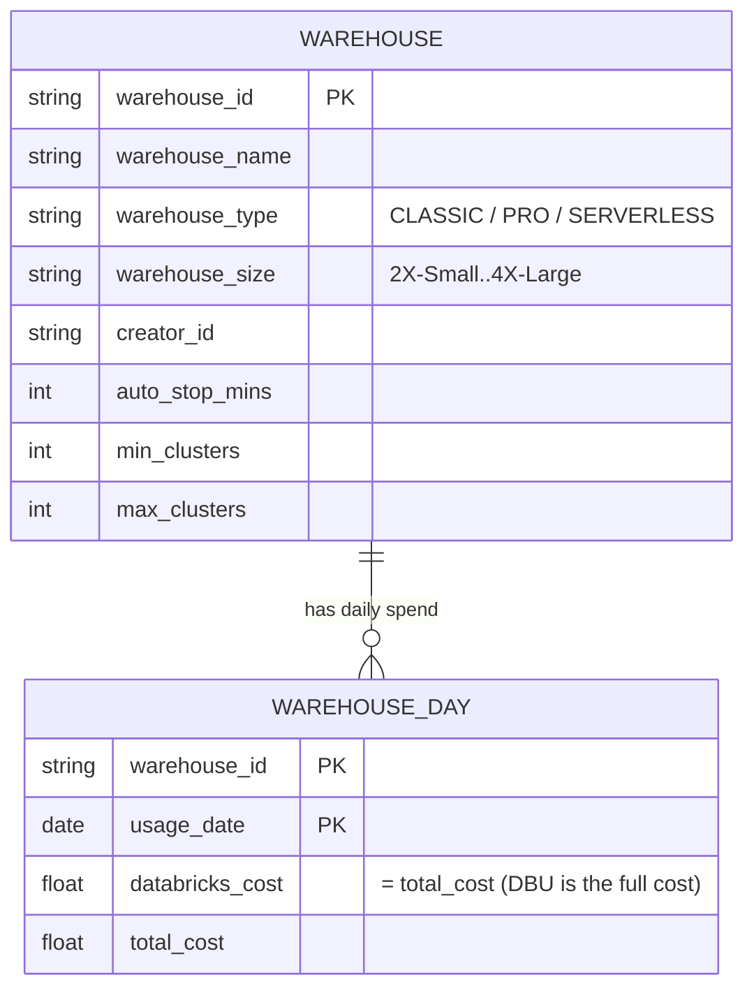

# Plan: SQL Warehouse Costs — 5th cost tab

> Status: **validated** · Scope: new "SQL Warehouses" tab (parallel to the four
> existing cost tabs) · All clouds

## Intent

DBSpend360 covers four compute-cost lenses today — Job Clusters, All-Purpose
Clusters, Instance Pools, Pipeline Compute — but **SQL Warehouses** (Classic,
Pro, and Serverless) are absent. SQL Warehouses are the primary interactive
analytics surface in Databricks and frequently the largest DBU line item for BI
and data-analyst workloads. Without this tab a user must leave the app and
manually query `system.billing.usage` to understand warehouse spend.

This plan adds a 5th tab, "SQL Warehouses", that follows the same end-to-end
pattern as the existing four: ETL staging → rollup → backend router → frontend
dashboard + AI analysis.

## Prerequisite validation (completed)

> **Every load-bearing assumption was validated against live data** via
> `claude_scripts/verify_sql_warehouse_prerequisites.py` before this plan was
> finalized. The LLM Council review (5 advisors + peer review + chairman
> synthesis) identified the questions; the query results below resolved them.

### Validation query results (30-day window, `adb-984752964297111`)

**Q1: `warehouse_id` population**
- SQL warehouse SKUs (`SERVERLESS_SQL_COMPUTE`, `SQL_PRO_COMPUTE`,
  `SQL_COMPUTE`): **`warehouse_id` is 100% populated** (0% null across all
  SQL warehouse SKUs). The grain assumption holds.
- Jobs serverless SKUs (`JOBS_SERVERLESS_COMPUTE`): `warehouse_id` is 100%
  NULL. These are serverless jobs, not SQL warehouses, but they share
  `billing_origin_product = 'SQL'`.
- **Implication:** the filter `billing_origin_product = 'SQL'` alone is
  insufficient. Must additionally require `usage_metadata.warehouse_id IS NOT
  NULL` to exclude jobs serverless compute rows.

**Q2: Grain contradiction (cluster_id cardinality)**
- **0 warehouse-days have >1 `cluster_id`.** All `cluster_id` values are NULL
  across all SQL warehouse SKUs (serverless/pro/classic on managed compute).
- **Implication:** the `(warehouse_id, usage_date)` grain is safe. No
  multi-cluster scaling within a warehouse-day. The council's grain concern
  was theoretically valid but does not materialize in practice.

**Q3: `system.compute.warehouses` accessibility**
- **Accessible.** Returns full metadata: `warehouse_name`, `warehouse_type`,
  `warehouse_size`, `min_clusters`, `max_clusters`, `auto_stop_minutes`,
  `tags`, `created_by`, `delete_time`. Full enrichment is feasible.

**Q4: Cloud cost explorer tag match**
- **0 explorer rows match any warehouse `cluster_id`.** Cloud cost attribution
  via tag-based join is dead on arrival — SQL warehouses run on Databricks-
  managed compute with no customer-visible Azure VMs or tags.
- **Implication:** this tab is **DBU-only for v1**. Cloud cost columns are
  dropped from the schema. DBU *is* the complete cost for managed-compute
  warehouses. This is not a data gap — it is architecturally correct.

**Q5: Warehouse type distribution**

| Type | Warehouses | Billing rows (30d) | DBUs |
|---|---|---|---|
| Serverless | 331 | 78,665 | 199,118 |
| Pro | 21 | 886 | 9,469 |
| Classic | 5 | 8 | 50 |

Serverless dominates (95.4% of DBU). Classic is negligible (5 warehouses, 50
DBUs). This confirms the DBU-only approach.

## Design decisions (validated)

| Decision | Choice | Validation |
|---|---|---|
| Warehouse types in scope | All — Classic, Pro, and Serverless | Q5: all three present in data |
| Rollup grain | `(warehouse_id, usage_date)` | Q2: no multi-cluster days; Q1: warehouse_id 100% populated for SQL SKUs |
| Cloud cost | **Dropped for v1** — DBU is the complete cost for managed compute | Q4: 0 explorer matches; all cluster_ids NULL |
| UI placement | New 5th tab — "SQL Warehouses" | — |
| Drill-down | DBU cost breakdown + warehouse config details | Top-queries deferred (see §below) |
| DBU filter | `billing_origin_product = 'SQL' AND usage_metadata.warehouse_id IS NOT NULL` | Q1: excludes JOBS_SERVERLESS rows with NULL warehouse_id |
| AI analysis | Yes — `/api/warehouses/{warehouse_id}/analyze` | — |
| Metadata enrichment | Full — name, type, size, creator, auto-stop, cluster count | Q3: system.compute.warehouses accessible |

### Top-queries decision (deferred to v2)

The LLM Council unanimously flagged that querying `system.query.history` at
read time (per modal-open) breaks the app's materialization-first architecture.
Every other data surface in DBSpend360 reads from materialized rollup tables.
Introducing a live query against a potentially enormous system table introduces
unpredictable latency, different failure modes, and a data freshness model that
contradicts everything else in the app.

**v1:** no top-queries drill-down. The details modal shows warehouse config +
cost summary only.

**v2 (future):** if top-queries are added, they should be materialized as a
lightweight daily rollup during ETL (e.g. `dbspend360_sql_warehouse_top_queries`
with grain `(warehouse_id, usage_date, query_hash)`) — not fetched live. This
also unlocks per-user chargeback, runaway-query detection, and query cost
regression tracking.

## Cross-tab overlap note

SQL Warehouse spend is a **new, additive lens** that does not overlap with the
existing four tabs in practice:

- **DBU rows** with `billing_origin_product = 'SQL'` and
  `usage_metadata.warehouse_id IS NOT NULL` are a distinct slice from
  `system.billing.usage`. They do not overlap with pipeline DBU
  (`dlt_pipeline_id IS NOT NULL`), job cluster DBU (`cluster_source = 'JOB'`),
  or all-purpose DBU (`cluster_source IN ('UI','API'), job_run_id IS NULL`).
- **Cloud cost** is dropped entirely for this tab (managed compute, no customer
  VMs), so there is no cloud-cost overlap with other tabs.

The existing "tabs overlap by design; don't sum tab totals" rule still applies
at the conceptual level, but in practice SQL Warehouse DBU is disjoint.

---

## Data model

### Entity relationship



### Grain: `(warehouse_id, usage_date)`

One row per warehouse per day. Validated: `warehouse_id` is account-unique
(not workspace-scoped like `pipeline_id`) and is 100% populated for all SQL
warehouse SKUs.

### Cost columns (DBU-only — no cloud cost)

| Column | Meaning | Notes |
|---|---|---|
| `databricks_cost` | DBU charges | Always present; *is* the complete cost for managed compute |
| `total_cost` | Same as `databricks_cost` | No cloud component to add |
| `currency` | ISO currency code | |

**Why no cloud cost columns:** SQL warehouses (Classic, Pro, and Serverless)
run on Databricks-managed compute. There are no customer-provisioned VMs, no
Azure resource tags, and the cloud cost explorer has zero matching rows (Q4).
DBU *is* the complete cost. Adding always-NULL cloud columns would be a
category error — misleading UX that implies a data gap where none exists. The
Pipeline tab's `cost_basis` / `compute_mode` pattern (which distinguishes
"serverless = full cost" from "classic = DBU-only") does not apply here because
*all* warehouse types are managed compute.

### Warehouse metadata columns (denormalized from `system.compute.warehouses`)

| Column | Type | Source | Notes |
|---|---|---|---|
| `warehouse_name` | STRING | `system.compute.warehouses` | Fallback: `"Warehouse {warehouse_id}"` |
| `warehouse_type` | STRING | `system.compute.warehouses` + SKU-derived | `CLASSIC` / `PRO` / `SERVERLESS` |
| `warehouse_size` | STRING | `system.compute.warehouses` | e.g. `2X_SMALL`, `SMALL`, `MEDIUM`, `LARGE` |
| `creator_id` | STRING | `system.compute.warehouses` | Who created the warehouse |
| `auto_stop_mins` | INT | `system.compute.warehouses` | Auto-stop timeout setting |
| `min_clusters` | INT | `system.compute.warehouses` | Min cluster count |
| `max_clusters` | INT | `system.compute.warehouses` | Max cluster count |
| `metadata_missing` | BOOLEAN | computed | True if no system table row found |
| `warehouse_deleted_at` | TIMESTAMP | `system.compute.warehouses` | Set if warehouse was deleted |
| `workspace_id` | STRING | `system.billing.usage` | Carried for coverage labeling |
| `workspace_covered` | BOOLEAN | `dbspend360_covered_workspaces` | Azure subscription coverage flag |

---

## Implementation phases

Each phase is independently deployable and testable. Phases 1-2 are ETL
(Databricks notebooks); Phase 3 is backend (FastAPI); Phase 4 is frontend
(React); Phase 5 is DAB wiring + verification. Phase 6 adds AI analysis.

The original 7-phase plan is condensed to 6: the cloud-cost rollup phase
(formerly Phase 3) is eliminated because cloud cost is dropped for v1.
Staging and rollup are merged since both are now DBU-only with metadata
denormalization.

---

### Phase 1 — DDL: staging + rollup tables

Create the two new Delta tables.

#### 1a. `dbspend360_sql_warehouse_dbu_cost` (staging)

New DDL notebook: `jobs/ddls/dbspend360_sql_warehouse_dbu_cost.ipynb`

Pattern: identical to `dbspend360_pipeline_dbu_cost.ipynb` (catalog/schema
widgets, `CREATE TABLE IF NOT EXISTS`, `CLUSTER BY AUTO`).

```sql
CREATE TABLE IF NOT EXISTS ${catalog}.${schema}.dbspend360_sql_warehouse_dbu_cost (
  warehouse_id        STRING,
  usage_date          DATE,
  databricks_cost     DOUBLE,
  currency            STRING,
  sku_name            STRING,
  warehouse_type      STRING,   -- CLASSIC / PRO / SERVERLESS (derived from SKU)
  workspace_id        STRING,
  workspace_covered   BOOLEAN,
  created_at          TIMESTAMP,
  updated_at          TIMESTAMP
)
CLUSTER BY AUTO
```

**Grain:** `(warehouse_id, usage_date)` — both non-nullable, plain `=` MERGE.

No `cluster_id` column: validation confirmed all `cluster_id` values are NULL
for SQL warehouse SKUs (managed compute). No cloud cost join to support.

#### 1b. `dbspend360_total_sql_warehouse_spends` (rollup)

New DDL notebook: `jobs/ddls/dbspend360_total_sql_warehouse_spends.ipynb`

```sql
CREATE TABLE IF NOT EXISTS ${catalog}.${schema}.dbspend360_total_sql_warehouse_spends (
  warehouse_id          STRING,
  usage_date            DATE,
  warehouse_name        STRING,
  warehouse_type        STRING,   -- CLASSIC / PRO / SERVERLESS
  warehouse_size        STRING,
  creator_id            STRING,
  auto_stop_mins        INT,
  min_clusters          INT,
  max_clusters          INT,
  metadata_missing      BOOLEAN,
  warehouse_deleted_at  TIMESTAMP,
  databricks_cost       DOUBLE,
  total_cost            DOUBLE,
  currency              STRING,
  sku_name              STRING,
  workspace_id          STRING,
  workspace_covered     BOOLEAN,
  created_at            TIMESTAMP,
  updated_at            TIMESTAMP
)
CLUSTER BY AUTO
```

**Grain:** `(warehouse_id, usage_date)`

No cloud cost columns (`cloud_cost`, `compute_cost`, `storage_cost`,
`network_cost`, `other_cost`). DBU is the complete cost.

#### Files touched

| File | Change |
|---|---|
| `jobs/ddls/dbspend360_sql_warehouse_dbu_cost.ipynb` | **new** |
| `jobs/ddls/dbspend360_total_sql_warehouse_spends.ipynb` | **new** |

#### Verification

- Run both DDL notebooks against the dev catalog/schema.
- Confirm tables exist with `DESCRIBE TABLE`.

---

### Phase 2 — ETL: staging + rollup notebooks

Two new notebooks that share the ETL pattern with the existing tabs.

#### 2a. Staging: `dbspend360_sql_warehouse_dbu_cost_app.ipynb`

New notebook: `jobs/notebooks/dbspend360_sql_warehouse_dbu_cost_app.ipynb`

Pattern: sibling of `dbspend360_pipeline_dbu_cost_app.ipynb`. Uses the same
`utils_common` infrastructure (audit log, date window, MERGE, validation).

**Key differences from Pipeline DBU Cost:**

| Aspect | Pipeline DBU | SQL Warehouse DBU |
|---|---|---|
| Usage filter | `usage_metadata.dlt_pipeline_id IS NOT NULL` | `billing_origin_product = 'SQL' AND usage_metadata.warehouse_id IS NOT NULL` |
| Entity ID | `usage_metadata.dlt_pipeline_id` → `pipeline_id` | `usage_metadata.warehouse_id` → `warehouse_id` |
| Grain | `(workspace_id, pipeline_id, usage_date, cluster_id, billing_origin_product)` | `(warehouse_id, usage_date)` |
| Warehouse type | N/A | Derived from `sku_name` (see below) |
| Update/maintenance split | Yes | No |
| MERGE key | 5-part with null-safe `<=>` on `cluster_id` | 2-part plain `=` (both non-nullable) |

**Algorithm:**

1. Read `system.billing.usage` filtered to the overlap window with
   `billing_origin_product = 'SQL' AND usage_metadata.warehouse_id IS NOT NULL`.
   The second predicate excludes `JOBS_SERVERLESS_COMPUTE` rows that share
   `billing_origin_product = 'SQL'` but have NULL `warehouse_id` (validated:
   ~62K rows/month excluded).
2. Extract `usage_metadata.warehouse_id` as `warehouse_id`.
3. INNER JOIN `system.billing.list_prices` on `(sku_name, usage_start_time ∈
   [price_start_time, price_end_time))` — same two-directional 1:1 guard as
   Pipeline DBU (DROP + FAN_OUT detection).
4. Compute `row_cost = usage_quantity * price`.
5. Derive `warehouse_type` from `sku_name`:
   - `sku_name LIKE '%SERVERLESS%'` → `'SERVERLESS'`
   - `sku_name LIKE '%PRO%'` → `'PRO'`
   - Else → `'CLASSIC'`
6. GROUP BY `(warehouse_id, usage_date)` → SUM `row_cost` as
   `databricks_cost`, first `warehouse_type`, first `workspace_id`,
   concat_ws collect_set `sku_name`.
7. `add_workspace_covered()` from `dbspend360_covered_workspaces`.
8. MERGE into `dbspend360_sql_warehouse_dbu_cost` on
   `(warehouse_id, usage_date)`.
9. Standard validations: schema, no negative costs, currency consistency,
   post-merge row count.
10. Audit log entry.

#### 2b. Rollup: `sql_warehouse_spends_app.ipynb`

New notebook: `jobs/notebooks/sql_warehouse_spends_app.ipynb`

Pattern: simplified version of `pipeline_spends_app.ipynb` (no cloud cost join,
no reconciliation). DBU staging + metadata denormalization only.

**Algorithm:**

1. Read `dbspend360_sql_warehouse_dbu_cost` for the overlap window. Already at
   `(warehouse_id, usage_date)` grain — no further aggregation needed.
2. SCD-collapse `system.compute.warehouses` to one row per `warehouse_id`
   (most recent snapshot via `QUALIFY ROW_NUMBER() OVER (PARTITION BY
   warehouse_id ORDER BY change_time DESC) = 1`).
3. LEFT JOIN on `warehouse_id` → denormalize `warehouse_name`,
   `warehouse_type` (prefer system table value, fallback to SKU-derived),
   `warehouse_size`, `creator_id`, `auto_stop_minutes` → `auto_stop_mins`,
   `min_clusters`, `max_clusters`, `delete_time` → `warehouse_deleted_at`.
4. `metadata_missing = warehouse_name IS NULL` (before COALESCE).
5. Fallback: `COALESCE(warehouse_name, CONCAT('Warehouse ', warehouse_id))`.
6. `total_cost = databricks_cost` (no cloud component).
7. MERGE into `dbspend360_total_sql_warehouse_spends` on
   `(warehouse_id, usage_date)`.
8. Standard validations + audit log entry.

#### Files touched

| File | Change |
|---|---|
| `jobs/notebooks/dbspend360_sql_warehouse_dbu_cost_app.ipynb` | **new** |
| `jobs/notebooks/sql_warehouse_spends_app.ipynb` | **new** |

#### Verification

- Run staging, then rollup notebook.
- Confirm both tables populated with non-zero row counts.
- Spot-check: `warehouse_type` distribution matches Q5 (mostly SERVERLESS).
- Verify `warehouse_name` populated (not all fallback).
- Audit log shows `SUCCESS` for both tasks.

---

### Phase 3 — Backend: FastAPI router + models + config

Pattern: parallel to `server/routers/pipelines.py`. Five endpoints (no
top-queries in v1).

#### 3a. Config

`config/app.dev.config` — add under `[databricks]`:

```ini
sql_warehouse_table_name = dbspend360.03apr.dbspend360_total_sql_warehouse_spends
```

`server/config/config_loader.py` — add `sql_warehouse_table_name` property
(same pattern as `pipeline_table_name`: explicit key with schema-based
fallback, `ConfigurationError` if neither is set).

#### 3b. Pydantic models

`server/models/job_spend.py` — add (after `PaginatedPipelines`):

- **`SqlWarehouseDailySpend`** — per-day row in the drill-down. Fields:
  `usage_date`, `databricks_cost`, `total_cost`, `warehouse_type`, `sku_name`.

- **`GroupedSqlWarehouse`** — warehouse-level rollup for the list view. Fields:
  `warehouse_id`, `warehouse_name`, `warehouse_type`, `warehouse_size`,
  `creator_id`, `auto_stop_mins`, `min_clusters`, `max_clusters`,
  `metadata_missing`, `warehouse_deleted_at`, `active_days`,
  `total_databricks_cost`, `total_cost`, `workspace_covered`,
  `days: list[SqlWarehouseDailySpend]`.

- **`SqlWarehouseSummaryMetrics`** — KPI strip. Fields: `total_warehouses`,
  `classic_warehouses`, `pro_warehouses`, `serverless_warehouses`,
  `total_spend`, `classic_spend`, `pro_spend`, `serverless_spend`,
  `total_databricks_cost`, `date_range_days`,
  `dbu_in_non_covered_workspaces`.

- **`SqlWarehouseDetails`** — warehouse config for the details modal. Fields:
  `warehouse_id`, `warehouse_name`, `warehouse_type`, `warehouse_size`,
  `creator_id`, `auto_stop_mins`, `min_clusters`, `max_clusters`,
  `metadata_missing`, `warehouse_deleted_at`, `tags` (Optional).

- **`SqlWarehouseAnalysis`** — LLM analysis. Fields: `warehouse_id`,
  `analysis`, `timestamp`.

- **`PaginatedSqlWarehouses`** — paginated response. Fields: `data`,
  `total_count`, `page`, `per_page`, `total_pages`, `has_next`, `has_previous`.

No `total_cloud_cost` fields anywhere — DBU is the complete cost.

#### 3c. Service methods

`server/services/databricks_service.py` — add methods:

- `get_sql_warehouse_summary_metrics(start_date, end_date)` →
  `SqlWarehouseSummaryMetrics`
- `get_sql_warehouses_grouped(start_date, end_date, search, limit, offset)` →
  `PaginatedSqlWarehouses`
- `get_top_sql_warehouses(start_date, end_date, limit)` →
  `list[GroupedSqlWarehouse]`
- `get_sql_warehouse_details(warehouse_id)` → `SqlWarehouseDetails`
- `get_sql_warehouse_cost_summary(warehouse_id)` → cost dict for LLM

#### 3d. Router

New file: `server/routers/sql_warehouses.py`

| Endpoint | Method | Response model | Description |
|---|---|---|---|
| `/api/warehouses/summary` | GET | `SqlWarehouseSummaryMetrics` | KPI strip |
| `/api/warehouses/grouped` | GET | `PaginatedSqlWarehouses` | Paginated list with per-day drill-down |
| `/api/warehouses/top-warehouses` | GET | `list[GroupedSqlWarehouse]` | Top-N most expensive |
| `/api/warehouses/{warehouse_id}/details` | GET | `SqlWarehouseDetails` | Warehouse config details |
| `/api/warehouses/{warehouse_id}/analyze` | GET | `SqlWarehouseAnalysis` | LLM analysis |
| `/api/warehouses/health` | GET | `{status, service}` | Smoke test |

Query parameters on `/summary`, `/grouped`, `/top-warehouses`: `start_date`,
`end_date` (required), `search` (optional, text filter on warehouse name/id).

#### 3e. App registration

`server/app.py` — import and include `sql_warehouses_router` (before the
StaticFiles catch-all, after `coverage_router`).

#### 3f. Coverage integration

`server/models/job_spend.py` (`ExcludedDbuByTab`) — add `sql_warehouse: float
= 0.0` field. `server/routers/coverage.py` — compute it as
`SUM(databricks_cost) WHERE workspace_covered = false` on the new rollup table.

This is a coordinated change across four layers (Pydantic model, coverage SQL,
TypeScript auto-generated type, `CoverageBanner` component) — tracked
explicitly, not hand-waved as "backward compatible."

#### Files touched

| File | Change |
|---|---|
| `config/app.dev.config` | add `sql_warehouse_table_name` |
| `server/config/config_loader.py` | add `sql_warehouse_table_name` property |
| `server/models/job_spend.py` | add 6 new models + extend `ExcludedDbuByTab` |
| `server/services/databricks_service.py` | add 5 new service methods |
| `server/routers/sql_warehouses.py` | **new** — 6 endpoints |
| `server/app.py` | import + include new router |
| `server/routers/coverage.py` | add `sql_warehouse` to excluded DBU query |

#### Verification

- Start dev server (`./watch.sh`).
- curl each endpoint:
  ```bash
  curl -s 'http://localhost:8000/api/warehouses/health' | jq
  curl -s 'http://localhost:8000/api/warehouses/summary?start_date=2026-07-01&end_date=2026-07-31' | jq
  curl -s 'http://localhost:8000/api/warehouses/grouped?start_date=2026-07-01&end_date=2026-07-31&page=1&per_page=10' | jq
  curl -s 'http://localhost:8000/api/warehouses/top-warehouses?start_date=2026-07-01&end_date=2026-07-31&limit=5' | jq
  ```
- Verify response shapes match the Pydantic models.
- Verify `/api/coverage` includes `sql_warehouse` in `excluded_dbu_by_tab`.

---

### Phase 4 — Frontend: SQL Warehouses tab

Pattern: parallel to `PipelineDashboard.tsx` / `PipelinesTable.tsx`.

#### 4a. Tab registration

`client/src/components/Dashboard.tsx`:
- Add `'sql-warehouses'` to `VALID_TABS`.
- Add `<TabsTrigger value="sql-warehouses">SQL Warehouses</TabsTrigger>`.
- Add `<TabsContent>` rendering `<SqlWarehousesDashboard />`.

#### 4b. Dashboard component

New file: `client/src/components/SqlWarehousesDashboard.tsx`

Pattern: mirror `PipelineDashboard.tsx`. Contains:
- Date range picker (same presets: Today, This Week, This Month, Last 30 Days).
- Summary cards strip (from `/api/warehouses/summary`).
- Search bar (warehouse name/id filter).
- `<SqlWarehousesTable />` component.
- Top-N warehouses card (from `/api/warehouses/top-warehouses`).
- Coverage banner (`<CoverageBanner />` reading `sql_warehouse` key).

#### 4c. Summary cards

KPI strip showing:
- **Total Spend** — `total_spend` (= total DBU cost, the complete cost)
- **SQL Warehouses** — `total_warehouses` with Classic/Pro/Serverless breakdown
- **Type breakdown** — Classic $ / Pro $ / Serverless $ (three-bucket)

No "Cloud vs DBU split" card — there is no cloud cost. The summary should
make clear that DBU is the complete cost for managed-compute warehouses.

#### 4d. Table component

New file: `client/src/components/SqlWarehousesTable.tsx`

One row per warehouse (from `/api/warehouses/grouped`). Columns:

| Column | Source | Notes |
|---|---|---|
| Warehouse Name | `warehouse_name` | With metadata badges (type, deleted, metadata_missing) |
| Type | `warehouse_type` | Badge: Classic / Pro / Serverless |
| Size | `warehouse_size` | |
| Active Days | `active_days` | |
| DBU Cost | `total_databricks_cost` | = total cost (complete cost for managed compute) |
| Total Cost | `total_cost` | |
| Actions | — | Expand (daily drill-down), Details, Analyze |

No "Cloud Cost" column — managed compute has no separate cloud cost.

Expandable row: per-day breakdown (`days[]` array).

Sorting: on `total_cost` (default desc), `total_databricks_cost`,
`active_days`, `warehouse_name`.

#### 4e. Drill-down modal

New file: `client/src/components/SqlWarehouseDetailsModal.tsx`

- **Cost summary**: total DBU cost for the period. No pie chart (there is no
  Cloud vs DBU split — DBU is the complete cost).
- **Warehouse config details**: from `/api/warehouses/{id}/details` — name,
  type, size, creator, auto-stop, min/max clusters, deleted status, tags.

No top-queries section in v1 (deferred — see §Top-queries decision above).

#### 4f. Display utilities

New file: `client/src/lib/sql-warehouse-display.ts`

- `WAREHOUSE_TYPE_LABELS` — badge text/color for Classic / Pro / Serverless
- Cost cell formatting (DBU = total cost, no cloud disambiguation needed)
- Coverage-related display: `workspace_covered === false` → "Not covered"
  tooltip on the DBU cost cell

#### 4g. API client hooks

- React Query hooks for all endpoints.
- Auto-generated TypeScript client from OpenAPI spec (runs automatically via
  `watch.sh`).

#### Files touched

| File | Change |
|---|---|
| `client/src/components/Dashboard.tsx` | add 5th tab |
| `client/src/components/SqlWarehousesDashboard.tsx` | **new** |
| `client/src/components/SqlWarehousesTable.tsx` | **new** |
| `client/src/components/SqlWarehouseDetailsModal.tsx` | **new** |
| `client/src/lib/sql-warehouse-display.ts` | **new** |
| `client/src/components/CoverageBanner.tsx` (existing) | add `sql_warehouse` tab key |

#### Verification

- Start dev server (`./watch.sh`).
- Open `http://localhost:5173/?tab=sql-warehouses`.
- Verify: tab renders, summary cards populate, table loads with pagination,
  search filters by name, drill-down modal opens with config details.
- Verify: no "Cloud Cost" column or pie chart.
- Verify: coverage banner shows correct excluded DBU for `sql_warehouse`.

---

### Phase 5 — DAB wiring + end-to-end verification

#### 5a. DAB task definitions

`jobs/resource_templates/DBSPEND360.yaml` — add 4 new tasks following the
deployment-paths rule:

```yaml
# DDL — SQL Warehouse staging table
- task_key: create_sql_warehouse_dbu_cost_table
  notebook_task:
    notebook_path: /Workspace/Users/aditya.mandiwal@databricks.com/deployed from cursor/jobs/ddls/dbspend360_sql_warehouse_dbu_cost
    source: WORKSPACE

# DDL — SQL Warehouse rollup table
- task_key: create_total_sql_warehouse_spends_table
  notebook_task:
    notebook_path: /Workspace/Users/aditya.mandiwal@databricks.com/deployed from cursor/jobs/ddls/dbspend360_total_sql_warehouse_spends
    source: WORKSPACE

# ETL — SQL Warehouse DBU cost staging
- task_key: Dbspend360_sql_warehouse_dbu_costs
  depends_on:
    - task_key: create_sql_warehouse_dbu_cost_table
    - task_key: covered_workspaces
  notebook_task:
    notebook_path: /Workspace/Users/aditya.mandiwal@databricks.com/deployed from cursor/jobs/notebooks/dbspend360_sql_warehouse_dbu_cost_app
    source: WORKSPACE

# ETL — SQL Warehouse rollup (no cloud_cost_explorer dependency — DBU-only)
- task_key: sql_warehouse_spends
  depends_on:
    - task_key: Dbspend360_sql_warehouse_dbu_costs
    - task_key: create_total_sql_warehouse_spends_table
  notebook_task:
    notebook_path: /Workspace/Users/aditya.mandiwal@databricks.com/deployed from cursor/jobs/notebooks/sql_warehouse_spends_app
    source: WORKSPACE
```

Note: the rollup task does **not** depend on `cloud_cost_explorer` (unlike
Pipeline). This is correct — there is no cloud cost to join.

#### DAG ordering

```
create_covered_workspaces_table
  └→ covered_workspaces ──────────────────────────────┐
                                                      ├→ Dbspend360_sql_warehouse_dbu_costs
create_sql_warehouse_dbu_cost_table ─────────────────┘       │
                                                             └→ sql_warehouse_spends
create_total_sql_warehouse_spends_table ────────────────────────┘
```

Simpler than Pipeline DAG (no `cloud_cost_explorer` fork).

#### 5b. End-to-end verification checklist

- [ ] Deploy notebooks to workspace (`deployed from cursor/...`)
- [ ] Run the full DAG with `sql_warehouse_*` tasks
- [ ] Both tables populated with non-zero row counts
- [ ] Audit log shows `SUCCESS` for both new tasks
- [ ] `warehouse_type` distribution matches Q5 (mostly SERVERLESS)
- [ ] `warehouse_name` populated from `system.compute.warehouses`
- [ ] `workspace_covered` propagated correctly
- [ ] No rows dropped vs raw SQL warehouse billing rows
- [ ] JOBS_SERVERLESS rows excluded (warehouse_id IS NOT NULL filter)
- [ ] Backend endpoints return valid responses (curl check)
- [ ] Frontend tab renders end-to-end with real data
- [ ] Coverage banner includes `sql_warehouse` excluded DBU
- [ ] Existing four tabs unaffected (regression check)

#### Files touched

| File | Change |
|---|---|
| `jobs/resource_templates/DBSPEND360.yaml` | add 4 new tasks |

---

### Phase 6 — AI analysis for SQL Warehouses

Pattern: mirror `server/services/llm_service.py` pipeline analysis.

#### 6a. LLM prompt

Add `SQL_WAREHOUSE_ANALYSIS_PROMPT` to `server/services/llm_service.py`.

The prompt should:
- Accept warehouse config (type, size, auto-stop, min/max clusters) + cost
  summary (DBU / total over the lookback window).
- Tailor recommendations to warehouse type:
  - **Serverless**: focus on DBU optimization (query patterns, caching, query
    complexity, result caching, predicate pushdown).
  - **Pro**: include sizing recommendations, auto-stop tuning, cluster scaling
    configuration.
  - **Classic**: same as Pro plus note that migration to Serverless/Pro may
    reduce costs.
- Include auto-stop configuration analysis (too long → idle waste; too short →
  cold-start latency). Specifically flag `auto_stop_mins > 30` as a cost signal.
- Note that DBU is the complete cost (no separate cloud VM cost to analyze).

#### 6b. LLM service method

Add `analyze_sql_warehouse_costs(warehouse_details, cost_summary)` to
`LLMService`.

Constants: `SQL_WAREHOUSE_MAX_TOKENS = 800` (same as Pipeline).

No `SQL_WAREHOUSE_DBU_ONLY_CAVEAT` needed — unlike Pipeline, there is no
cloud-cost gap to disclaim. DBU is architecturally the complete cost for all
warehouse types.

#### 6c. Feature flag

Add `enable_warehouse_analysis` to `config/app.dev.config` `[features]` and
`config_loader.py`. Default: `true`.

#### Files touched

| File | Change |
|---|---|
| `server/services/llm_service.py` | add prompt + method + constants |
| `config/app.dev.config` | add `enable_warehouse_analysis = true` |
| `server/config/config_loader.py` | add `enable_warehouse_analysis` property |

#### Verification

- curl the analyze endpoint:
  ```bash
  curl -s 'http://localhost:8000/api/warehouses/{warehouse_id}/analyze' | jq
  ```
- Verify: analysis text is grounded in actual warehouse config and cost data.
- Verify: no misleading references to cloud cost gaps.
- Verify: structured fallback fires gracefully when LLM is unavailable.

---

## Documentation updates

After all phases are complete, update:

| File | Change |
|---|---|
| `docs/product.md` | add SQL Warehouses tab to §1, §2, §6 |
| `docs/data_model.md` | add §3.5 SQL Warehouses entity + update §4 cross-tab model |
| `docs/data_model_reference.md` | add columns, DAG tasks, API endpoints |
| `README.md` | update feature list + tab count |

---

## Files touched (complete summary)

| File | Phase | Change |
|---|---|---|
| `jobs/ddls/dbspend360_sql_warehouse_dbu_cost.ipynb` | 1 | **new** DDL |
| `jobs/ddls/dbspend360_total_sql_warehouse_spends.ipynb` | 1 | **new** DDL |
| `jobs/notebooks/dbspend360_sql_warehouse_dbu_cost_app.ipynb` | 2 | **new** ETL staging |
| `jobs/notebooks/sql_warehouse_spends_app.ipynb` | 2 | **new** ETL rollup |
| `config/app.dev.config` | 3,6 | add `sql_warehouse_table_name` + feature flag |
| `server/config/config_loader.py` | 3,6 | add properties |
| `server/models/job_spend.py` | 3 | add 6 models + extend `ExcludedDbuByTab` |
| `server/services/databricks_service.py` | 3 | add 5 service methods |
| `server/routers/sql_warehouses.py` | 3 | **new** router (6 endpoints) |
| `server/app.py` | 3 | include new router |
| `server/routers/coverage.py` | 3 | extend excluded DBU query |
| `client/src/components/Dashboard.tsx` | 4 | add 5th tab |
| `client/src/components/SqlWarehousesDashboard.tsx` | 4 | **new** |
| `client/src/components/SqlWarehousesTable.tsx` | 4 | **new** |
| `client/src/components/SqlWarehouseDetailsModal.tsx` | 4 | **new** |
| `client/src/lib/sql-warehouse-display.ts` | 4 | **new** |
| `client/src/components/CoverageBanner.tsx` | 4 | extend |
| `jobs/resource_templates/DBSPEND360.yaml` | 5 | add 4 tasks |
| `server/services/llm_service.py` | 6 | add prompt + method |

---

## Scope guardrails

- **No changes to existing tabs.** The four existing rollup tables, ETL
  notebooks, backend routers, and frontend components are untouched (except
  extending `ExcludedDbuByTab` and `CoverageBanner` — tracked explicitly in
  Phase 3 and Phase 4).
- **No cloud cost columns.** DBU is the complete cost for managed-compute SQL
  Warehouses. No `cloud_cost`, `compute_cost`, `storage_cost`, `network_cost`,
  `other_cost` columns anywhere in the schema, backend, or frontend.
- **No read-time system table queries.** All data surfaces read from
  materialized rollup tables. `system.query.history` is deferred to v2 as a
  materialized ETL, not a live query.
- **No change to the cross-tab overlap model.** SQL Warehouses is a new,
  additive lens. Tab totals still should not be summed.
- **`workspace_id` is carried but not keyed.** `warehouse_id` is
  account-unique (validated), so the grain does not need `workspace_id`. It is
  kept as a dimension for coverage labeling only.

## Resolved items (formerly "open items")

All five original open items have been resolved by the prerequisite validation:

| Item | Resolution |
|---|---|
| `system.compute.warehouses` accessibility | **Accessible** (Q3). Full metadata available. |
| `system.query.history` accessibility | **Deferred** to v2. Will be materialized, not read-time. |
| `usage_metadata.warehouse_id` reliability | **100% populated** for SQL warehouse SKUs (Q1). Must filter with `IS NOT NULL` to exclude JOBS_SERVERLESS. |
| Classic/Pro `cluster_id` in cloud cost explorer | **No matches** (Q4). All `cluster_id` values are NULL. Cloud cost dropped. |
| `ExcludedDbuByTab` backward compatibility | **Tracked explicitly** as a coordinated 4-layer change (Phase 3f + 4f). |

## Future work (v2)

- **Materialized top-queries rollup:** ETL notebook producing
  `dbspend360_sql_warehouse_top_queries` at grain `(warehouse_id, usage_date,
  query_hash)` from `system.query.history`. Unlocks per-user chargeback,
  runaway-query alerts, cost-per-dashboard attribution, query cost regression
  detection.
- **Serverless query efficiency metrics:** DBU per row scanned, DBU per query
  — metrics that differentiate DBSpend360 from what the Databricks console
  shows for opaque serverless pricing.
- **Cross-workspace benchmarking:** `warehouse_id` is account-unique, enabling
  cross-workspace comparisons (same warehouse type, different teams) with no
  extra ETL.
